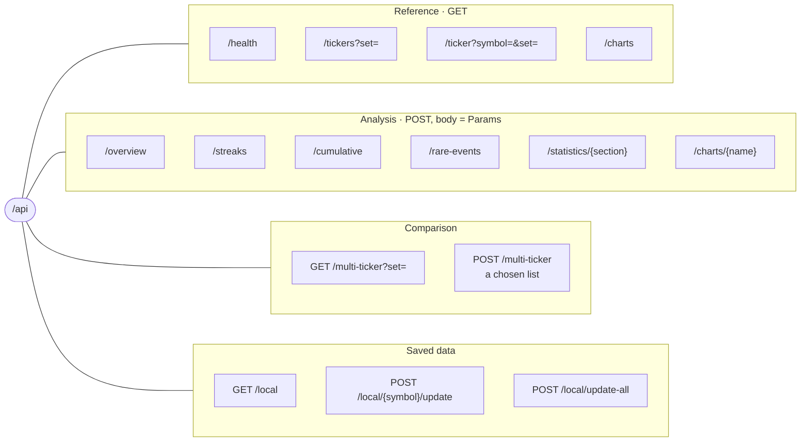
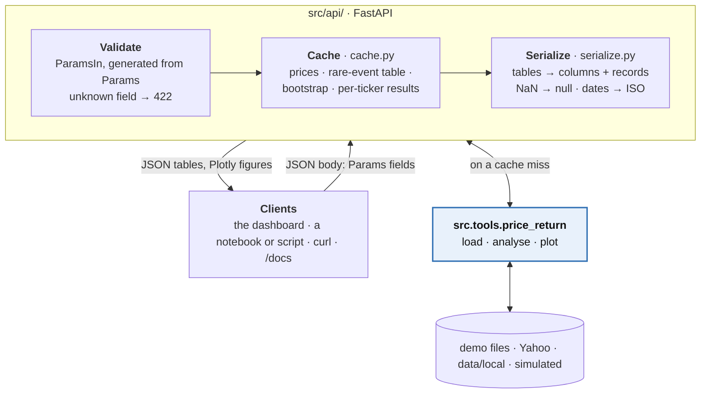
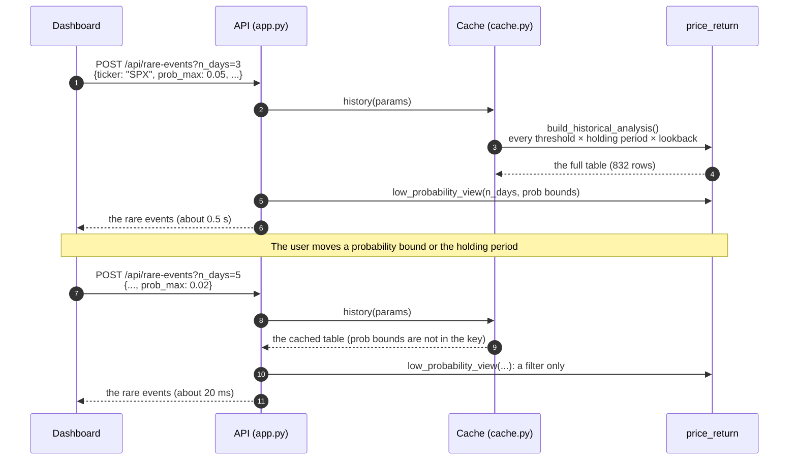

# The HTTP API

`src/api/` serves the price-return analysis as JSON. The dashboard uses it, and so can a notebook,
a script or `curl`. Every number and chart it returns comes from `src.tools.price_return`, the
same tested functions the notebooks call. The API validates the request, calls the package, and
turns the answer into JSON; it computes nothing itself. See the README's
[Development workflow](../README.md#development-workflow) for where it fits, and
[`dashboard.md`](dashboard.md) for the dashboard built on it.

- [Run the API on its own](#run-the-api-on-its-own)
- [Endpoints](#endpoints)
- [How a query works](#how-a-query-works)
- [Examples](#examples)
- [Errors](#errors)
- [Caching](#caching)

## Run the API on its own

From the repo root, with Python 3.12 or newer:

```bash
pip install -e ".[api,stats]"     # fastapi and uvicorn; scipy for the statistics endpoints
python -m src.api                 # http://127.0.0.1:8000
```

The dashboard does not need to be built. Without a build the API runs as usual, and the page at
`/` explains how to build the dashboard. The server listens on this computer only.

| Option | Effect |
|---|---|
| `--port 8080` | another port (default 8000) |
| `--reload` | restart when a Python file changes, for development |
| `--open` | open the address in a browser |
| `--host 0.0.0.0` | listen on every network interface. The API has no login, so it prints a warning; use this only on a network you trust |

`uvicorn src.api.app:app --reload` runs the same app directly. While it runs:

- http://127.0.0.1:8000/docs is the interactive documentation (Swagger UI). It lists every
  endpoint with its parameters, and **Try it out** sends real requests.
- http://127.0.0.1:8000/openapi.json is the machine-readable schema, for generating a client.
- `notebooks/api_examples.ipynb` calls every endpoint from Python and draws the answers as tables
  and charts. It starts a server itself if none is running.

The examples on this page use the demo data (`data/demo`, processed data, not market data), so
they run offline. Their output was captured from this code, trimmed where long.

## Endpoints



**Reference** (GET, no body):

| Endpoint | Returns | Query |
|---|---|---|
| `GET /api/health` | `status`, the API `version`, and whether the dashboard is built | — |
| `GET /api/tickers` | a ticker set: each ticker's `symbol`, `label`, `params` (a ready-made request body) and what is `saved` of it in `data/local` | `set`: `demo` (default), `yahoo` or `local` |
| `GET /api/ticker` | the same for one symbol, listed in the config or not (unlisted symbols get the config's defaults) | `symbol` (letters, digits and `^ = . _ -`, e.g. `ES=F`, `^GSPC`); `set` (default `yahoo`) |
| `GET /api/charts` | every chart name, its group, and the query options it reads | — |

**Analysis** (POST, body = the `Params` fields; see [How a query works](#how-a-query-works)):

| Endpoint | Package functions | Query |
|---|---|---|
| `POST /api/overview` | `load_price_data`, `latest_snapshot`, `distribution_summary` | — |
| `POST /api/streaks` | `detect_streaks`, `summarize_streaks` | — |
| `POST /api/cumulative` | `analyze_cumulative`, `summarize_cumulative` | — |
| `POST /api/rare-events` | `build_historical_analysis`, `low_probability_view`: the rare-but-observed events, with `prob` between the body's `prob_min` and `prob_max` | `n_days`: holding period(s), each one of the body's `streak_days`, repeatable (default 3); `change_type`: `consecutive` or `cumulative` (default both) |
| `POST /api/statistics/{section}` | `section` = `distribution` (moments, Jarque–Bera, Student-t, tail index, VaR), `dependence` (autocorrelation, Ljung–Box, variance ratio, ARCH-LM), `drawdowns` (risk ratios, deepest drawdowns) or `probabilities` (`event_probability_table`: bootstrap intervals and model probabilities) | `n_days` (probabilities, default 3); `n_boot` (100–2000, default 1000); `top` (drawdowns, 1–20, default 5) |
| `POST /api/charts/{name}` | one `viz.plot_*` figure as Plotly JSON, identical to the notebook's | the options `GET /api/charts` lists for that chart: `window`, `top` (1–10, default 3), `n_days` (default 3), `n_boot`, `change_type` (default `cumulative`), `change` (`above` or `below`), `n_years` |

The 14 chart names: `rolling-average`, `rolling-volatility`, `price-and-returns`,
`return-distribution`, `streak-counts`, `streak-frequency`, `streak-timeline`,
`cumulative-heatmap` and `cumulative-counts` (analysis); `qq`, `autocorrelation`, `drawdown`,
`rolling-risk` and `event-probabilities` (statistics).

**Comparison:**

| Endpoint | Returns | Inputs |
|---|---|---|
| `GET /api/multi-ticker` | `analyze_ticker` for every ticker of a set, then `compare_tickers`: cross-ticker streak and distribution tables | query: `set` (default `demo`), `drill_n_days` (1–250, default 3) |
| `POST /api/multi-ticker` | the same for a chosen list, which may mix sets. When it does, each row's name says its source, so the same symbol live and saved can sit side by side | body: `{"tickers": [{"symbol": ..., "set": ...}, ...], "drill_n_days": 3}`, 1 to 30 tickers |

**Saved data** (`data/local`, git-ignored; see the README's
[Saved live data](../README.md#saved-live-data)):

| Endpoint | Returns | Query |
|---|---|---|
| `GET /api/local` | the folder, and each saved symbol's `rows`, `first` and `last` date and `updated` time | — |
| `POST /api/local/{symbol}/update` | `save_local`: downloads the symbol from Yahoo the first time, or only the new bars afterwards. Returns `created`, `rows`, `added`, `first`, `last`, and `revised` (any saved bar Yahoo has changed). Bars are saved up to yesterday, and a failed download leaves the file as it was | `start_date` (default `2016-01-01`, first download only) |
| `POST /api/local/update-all` | `save_all`: the same for every ticker in `configs/tickers.yaml`, or for the body's `{"symbols": [...]}` (1 to 50). Returns each symbol's result under `saved` and each failure, with its error, under `failed`; one failure does not stop the rest, and only if every symbol fails is it a 502 | `start_date`, as above |

## How a query works



**The body says what to analyse; the query string says what to show.** Every analysis endpoint
takes the same JSON body: the fields of `Params` (`src/tools/price_return/params.py`), the object
the notebooks configure. The request model is generated from that dataclass
(`src/api/schemas.py`), so a new `Params` field is accepted by the API without any change to it.

- **Omitted fields take `Params`'s defaults.** `{}` is a valid body; it analyses the simulated
  series. A misspelt field is rejected with 422 rather than silently ignored.
- **A ready-made body:** each ticker in `GET /api/tickers` comes with `params`, the parameters its
  config file sets (thresholds, windows, data source). Send it as the body, changing any field you
  like. This is what the dashboard does.
- **The fields most often set:**

| Field | Meaning | Units |
|---|---|---|
| `data_source` | `simulated` (default), `demo`, `yahoo` or `local` | — |
| `ticker` | the symbol: a demo name (`SPX`), a Yahoo symbol (`ES=F`) or a saved one | — |
| `start_date`, `end_date` | `YYYY-MM-DD`. `end_date` is exclusive and defaults to today | — |
| `win_threshold`, `loss_threshold` | the daily return that counts as a win or a loss | percent: `0.5` is 0.5% |
| `windows`, `cum_thresholds` | streak lengths in days; cumulative-move thresholds | days; percent |
| `return_thresholds`, `prob_max`, `prob_min` | rare-event move sizes and probability bounds | decimal: `0.01` is 1% |
| `streak_days`, `lookback_years` | rare-event holding periods and lookbacks | days; years |
| `trade_days` | trading days per year, for annualizing | days |

The units differ between groups for historical reasons; the `Params` docstring lists them all.

**Responses** are plain JSON:

- **Tables** come as `{"columns": [...], "records": [{...}, ...]}`. The column order is sent
  explicitly, because JavaScript would otherwise reorder numeric-looking keys. In pandas:
  `pd.DataFrame(t["records"], columns=t["columns"])`.
- **Charts** come as a Plotly figure, `{"data": [...], "layout": {...}}`. Plotly.js draws it
  directly, and in Python `plotly.io.from_json(json.dumps(fig))` rebuilds the figure.
- **Missing values** (NaN, infinity) are `null`, and **dates** are ISO strings
  (`2025-12-31T00:00:00`).
- **Numbers** are not rounded: formatting is left to the client.

## Examples

**An overview** of the demo S&P 500 series over ten years:

```bash
curl -s -X POST http://127.0.0.1:8000/api/overview -H 'Content-Type: application/json' \
     -d '{"data_source": "demo", "ticker": "SPX", "start_date": "2016-01-01", "end_date": "2026-01-01"}'
```

```json
{
  "ticker": "SPX", "data_source": "demo", "rows": 2513,
  "start": "2016-01-05T00:00:00", "end": "2025-12-31T00:00:00", "last_price": 6845.279644,
  "snapshot": {"annualized_return": 0.1638, "annualized_volatility": 0.1868,
               "daily_avg_return": 0.000676, "daily_std_dev": 0.011817},
  "distribution": {"ticker": "SPX", "drift (mean)": 0.0553, "median": 0.0738, "skew": -0.378,
                   "days > +thr": 28.09, "days < -thr": 21.33, "up:down": 1.317}
}
```

The first return is on 2016-01-05: the first close loaded, 2016-01-04, has no day before it.

**Rare events.** These are the 3-day cumulative moves with an observed probability below 5%, each
with the date it last happened:

```bash
curl -s -X POST 'http://127.0.0.1:8000/api/rare-events?n_days=3&change_type=cumulative' \
     -H 'Content-Type: application/json' \
     -d '{"data_source": "demo", "ticker": "SPX", "start_date": "2016-01-01", "end_date": "2026-01-01", "prob_max": 0.05}'
```

```json
{
  "n_days": [3], "change_type": "cumulative", "prob_max": 0.05, "prob_min": 0.0001,
  "total_events": 832,
  "events": {
    "columns": ["change_type", "change", "threshold", "n_days", "n_years", "n_obs", "n_windows",
                "count", "episodes", "prob", "last_occurred"],
    "records": [
      {"change_type": "cumulative", "change": "above", "threshold": 0.025, "n_days": 3,
       "n_years": 2, "n_obs": 500, "n_windows": 498, "count": 24, "episodes": 15,
       "prob": 0.0482, "last_occurred": "2025-11-26"},
      ...
    ]
  }
}
```

Read the first row as follows. Over the last 2 years there were 498 three-day windows, and the
S&P 500 rose more than 2.5% in 24 of them. That makes `prob` = 24 / 498 = 4.8%. Overlapping
windows are grouped into 15 separate episodes, and the last one ended on 2025-11-26. 22 of the 832 rows in the full table pass the
filter.

**A chart**, here the drawdown chart with its three deepest troughs labelled:

```bash
curl -s -X POST 'http://127.0.0.1:8000/api/charts/drawdown?top=3' -H 'Content-Type: application/json' \
     -d '{"data_source": "demo", "ticker": "SPX", "start_date": "2016-01-01", "end_date": "2026-01-01"}'
# {"data": [{"type": "scatter", ...}], "layout": {"title": {"text": "Drawdown from the running peak"}, ...}}
```

**A comparison** of a chosen list of tickers:

```bash
curl -s -X POST http://127.0.0.1:8000/api/multi-ticker -H 'Content-Type: application/json' \
     -d '{"tickers": [{"symbol": "SPX", "set": "demo"}, {"symbol": "CL", "set": "demo"},
                      {"symbol": "EURUSD", "set": "demo"}], "drill_n_days": 3}'
```

```json
{
  "set": null, "drill_n_days": 3,
  "tickers": [{"symbol": "SPX", "set": "demo", "label": "S&P 500 index (demo)", "rows": 2699, ...}, ...],
  "streaks": {"columns": ["ticker", "2d win/loss", "3d win/loss", "5d win/loss", "3d ratio"],
              "records": [{"ticker": "S&P 500 index (demo)", "2d win/loss": "16.72 / 10.86",
                           "3d win/loss": "6.67 / 3.63", "5d win/loss": "0.85 / 0.41",
                           "3d ratio": 1.84}, ...]},
  "distribution": {"columns": ["ticker", "drift (mean)", "median", "skew", "days > +thr",
                               "days < -thr", "up:down"], "records": [...]},
  "failed": []
}
```

Each win/loss column gives the percentage of 2-, 3- or 5-day windows in which every day was a
win, and the same for losses, using the ticker's own thresholds from its config. The ratio
divides the two at `drill_n_days`: the S&P 500's 3-day winning runs are 1.84 times as common as
its losing ones. A ticker that fails, such as a Yahoo
symbol with no data, is listed under `failed` with its error, and the others are still compared.

**From Python**, with only the standard library and pandas:

```python
import json
from urllib.request import Request, urlopen

import pandas as pd

BASE = 'http://127.0.0.1:8000'

def post(path, body):
    request = Request(BASE + path, data=json.dumps(body).encode(),
                      headers={'Content-Type': 'application/json'})
    with urlopen(request) as response:
        return json.load(response)

def get(path):
    with urlopen(BASE + path) as response:
        return json.load(response)

# The body for SPX as its config sets it, over a fixed range.
spx = next(t for t in get('/api/tickers?set=demo')['tickers'] if t['symbol'] == 'SPX')
body = {**spx['params'], 'start_date': '2016-01-01', 'end_date': '2026-01-01'}

table = post('/api/statistics/drawdowns?top=3', body)['drawdowns']
print(pd.DataFrame(table['records'], columns=table['columns']))
#       depth                 peak  ... days_to_trough days_to_recover
# 0 -0.339110  2020-02-19T00:00:00  ...             23           103.0
# 1 -0.254329  2022-01-03T00:00:00  ...            195           318.0
# 2 -0.197638  2018-09-20T00:00:00  ...             65            81.0
```

## Errors

Errors carry a `detail` that says what went wrong, never a stack trace:

| Status | When | Example `detail` |
|---|---|---|
| 422 | a field that `Params` does not have, or a value of the wrong type | `[{"type": "extra_forbidden", "loc": ["body", "tickr"], "msg": "Extra inputs are not permitted"}]` |
| 422 | a request that cannot succeed: an unknown demo ticker, an `n_days` not in `streak_days`, a symbol not saved | `"No demo data for ticker 'ZZZ'. Demo tickers: AAPL, CL, EURUSD, ..."` |
| 404 | an unknown chart name | `"No chart 'nope'; charts: rolling-average, ..."` |
| 502 | the data source failed: Yahoo unreachable or rate-limiting, a failed download | `"Data source failed: ..."` |
| 501 | a statistics function that needs scipy, which is not installed | `"This needs scipy; from the repo root run: pip install -e \".[stats]\""` |

`/api/multi-ticker` and `/api/local/update-all` are the exceptions: they list failing tickers under
`failed` and fail (502) only when every ticker does.

## Caching

The API keeps recent results in memory, so a dashboard session does not download again or
recompute what it has already shown. The caches are per process and are emptied when the server
restarts.

| Cache | Keyed by | So |
|---|---|---|
| prices (`load_price_data` + rolling statistics) | the data fields: source, ticker, dates, simulation settings | changing a threshold reuses the prices; `end_date` defaults to today, so a new day reloads |
| the rare-event table (`build_historical_analysis`) | the data fields plus `trade_days`, `return_thresholds`, `lookback_years`, `streak_days` | moving `prob_min`, `prob_max`, `n_days` or `change_type` only filters it |
| event probabilities (bootstrap) | the same, plus `n_days` and `n_boot` | the bootstrap, which takes seconds, runs once per setting |
| multi-ticker results | every `Params` field and the label | failures are not cached, so a failed ticker is retried next time |

For saved data (`local`), every key also includes the file's modification time. After an
update, from the dashboard or `scripts/update_local_data.py`, the next request reads the new
file without a restart.

The rare-event table shows why this matters:



The timings are for ten years of daily demo data on the machine these docs were written on.
