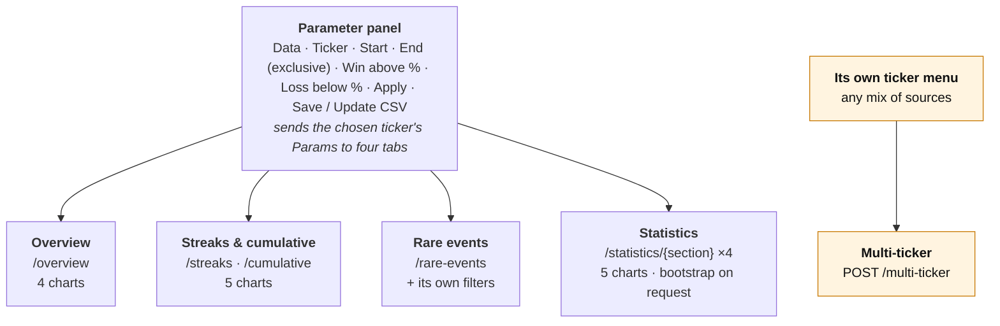
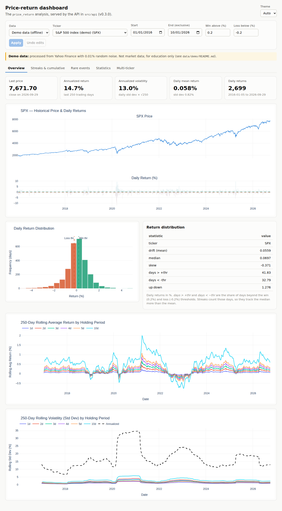
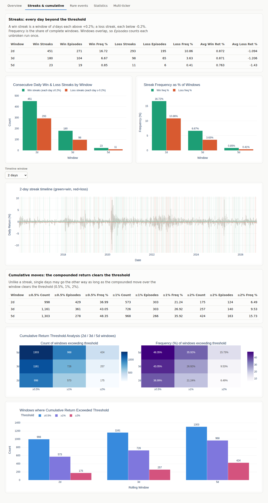
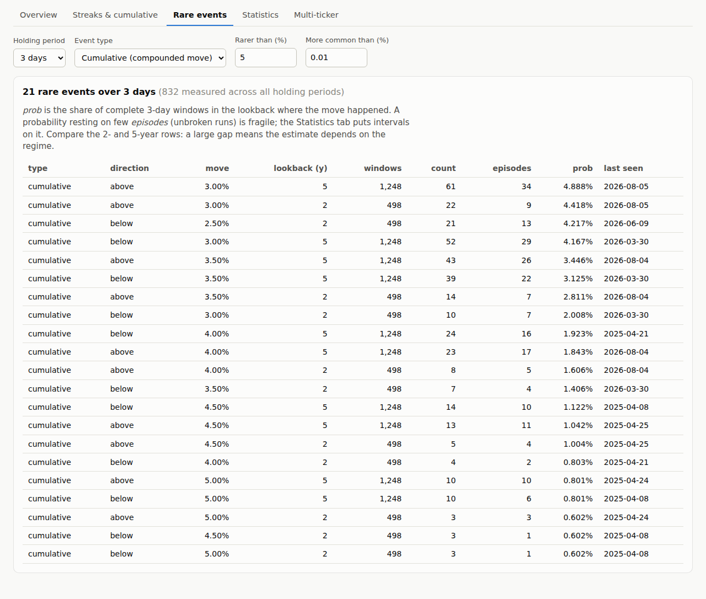
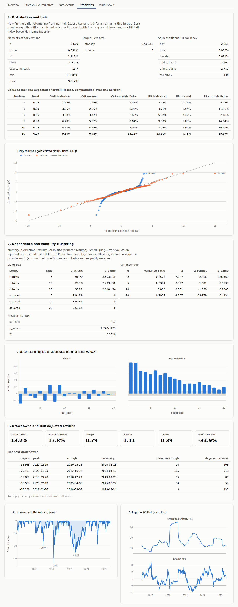
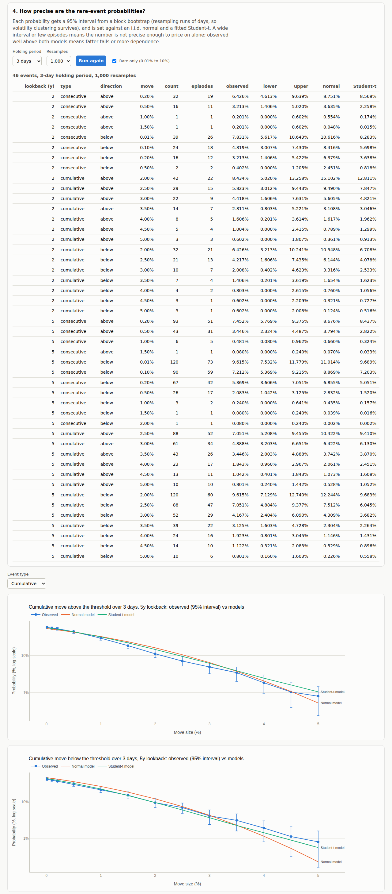
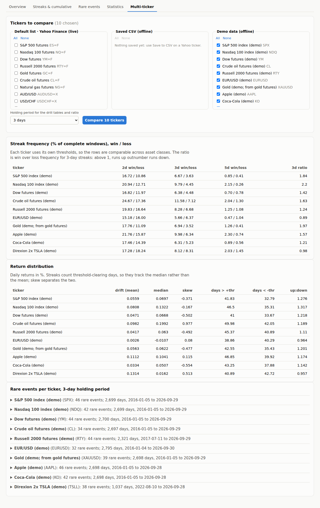
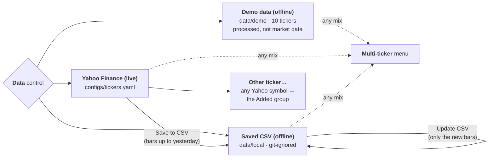
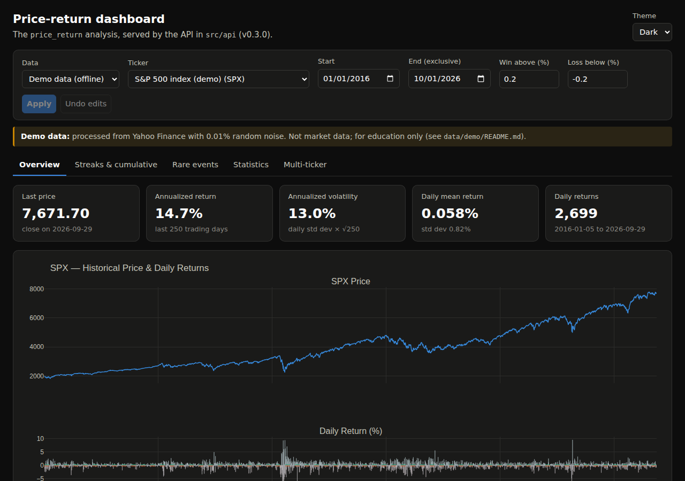
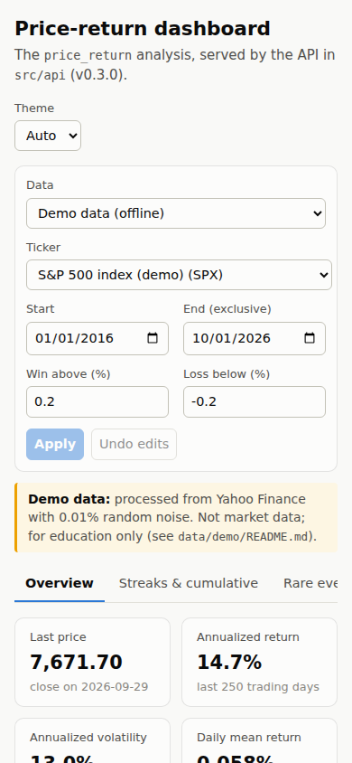

# The dashboard

The dashboard is a React app (`dashboard/`) over the price-return analysis. It is where a
question about an instrument gets explored and where findings are presented (see the README's
[Development workflow](../README.md#development-workflow)). Every number and chart on it comes
from the tested package `src.tools.price_return` through the [HTTP API](api.md). The browser
only lays them out, formats them and handles the controls.

- [Start it](#start-it)
- [How the page works](#how-the-page-works)
- [Overview](#overview)
- [Streaks & cumulative](#streaks--cumulative)
- [Rare events](#rare-events)
- [Statistics](#statistics)
- [Multi-ticker](#multi-ticker)
- [Data choices](#data-choices)
- [Theme and phone layout](#theme-and-phone-layout)

The screenshots show the S&P 500 demo series (`SPX`, from `data/demo`: processed data, not
market data) from 2016 to 2026-09-29, with the thresholds `configs/demo_tickers.yaml` sets for it
(a win is a day above +0.2%, a loss a day below −0.2%). `npm run screenshots` in `dashboard/`
retakes them all from the running app (`dashboard/e2e/screenshots.ts`).

## Start it

From the repo root (Python 3.12+, Node 20+):

```bash
pip install -e ".[api,stats]"
cd dashboard && npm install && npm run build && cd ..
python -m src.api            # then open http://127.0.0.1:8000
```

The README's [Dashboard](../README.md#dashboard) section covers the options, development mode
(`python scripts/dev.py`) and the checks.

## How the page works



The **parameter panel** across the top chooses what to analyse:

- **Data** chooses the source. See [Data choices](#data-choices).
- **Ticker** applies at once, with that ticker's parameters from its config file.
- **Start** and **End** set the date range. End is exclusive and defaults to today.
- **Win above (%)** and **Loss below (%)** set the daily returns that count as a winning or a
  losing day. The streak and distribution views read them.

Edits to the dates and thresholds take effect with **Apply**, and **Undo edits** discards them.
A start after the end, or a win threshold that is not positive, is refused before anything is
sent.

The first four tabs analyse the chosen ticker. Each asks the API for its own tables and charts,
and the answers are cached, so switching tabs or coming back is instant. **Multi-ticker** is
separate: it has its own menu and compares several tickers at once. A yellow notice under the
panel marks the demo data whenever it is shown.

## Overview



**What it answers:** what the series looks like, and how it is behaving now.

- **The tiles** show:
  - the last close;
  - the annualized return over the last `trade_days` (250) days, compounded;
  - the annualized volatility, which is the daily standard deviation × √250 (here
    0.82% × √250 = 13.0%);
  - the mean daily return;
  - how many daily returns were loaded, and their range.

  The first day loaded has no return, so the range starts a day later.
- **Price and daily returns:** the price above, and each day's return below with the win and
  loss thresholds as dashed lines. Clusters of large bars, as in 2020, are volatility clustering,
  which the Statistics tab tests for.
- **Return distribution:** a histogram of daily returns, coloured by sign, with the thresholds
  marked. The table beside it gives:
  - the mean ("drift") and the median, both in %;
  - the skew;
  - the share of days beyond each threshold (`days > +thr`, `days < -thr`);
  - their ratio (`up:down`).

  Streaks count threshold-clearing days, so they follow the median more than the mean.
- **Rolling average return** and **rolling volatility:** the mean and standard deviation of the
  1-, 2-, 3-, 4-, 5- and 10-day compounded returns over a trailing 250-day window. The
  volatility chart also shows the annualized line. A regime change appears as all the lines
  moving together.

Package: `load_price_data`, `add_rolling_stats`, `latest_snapshot`, `distribution_summary`,
`plot_price_and_returns`, `plot_return_distribution`, `plot_rolling_average`,
`plot_rolling_volatility`.

## Streaks & cumulative



**What it answers:** how often the instrument runs in one direction, measured in two
different ways.

- **Streaks: every day beyond the threshold.** A *d*-day win streak is a window of *d* days that
  are each above the win threshold; a loss streak is the same below the loss threshold.
  - **Count** is how many such windows there were.
  - **Episodes** counts each unbroken run once. Windows overlap, so a 6-day run contains five
    2-day streaks.
  - **Freq %** divides the count by the number of complete windows.
  - **Avg Win/Loss Ret %** is the mean daily return on a streak's days, averaged over the
    streaks.

  On the demo S&P 500, 16.7% of 2-day windows were win streaks against 10.9% loss streaks. The
  two bar charts show the same counts and frequencies.
- **Streak timeline:** daily returns with every streak window shaded, green for wins and red for
  losses. **Timeline window** chooses the streak length shown.
- **Cumulative moves: the compounded return clears the threshold.** These are windows whose
  *compounded* return clears 0.5%, 1% or 2%, whatever the individual days did. A window can rise
  2% overall while containing a losing day, so this answers a different question from the
  streaks. The heatmaps show counts and frequencies by window and threshold, and the bars show
  the counts again.

Package: `detect_streaks`, `summarize_streaks`, `analyze_cumulative`, `summarize_cumulative`,
`plot_streak_counts`, `plot_streak_frequency`, `plot_streak_timeline`,
`plot_cumulative_heatmap`, `plot_cumulative_counts`.

## Rare events



**What it answers:** which moves are rare, how rare they are, and when they last happened.

The API measures every combination of:

- move size (0.01% to 5%);
- holding period (1 to 30 days);
- lookback (the last 2 and 5 years);
- type (*cumulative*: the compounded move; *consecutive*: every day of the window);
- direction.

This tab shows the combinations that did happen, but rarely. The controls refilter the table at
once, because the server keeps the full table (see [Caching](api.md#caching)):

- **Holding period:** the window length.
- **Event type:** both types, or one of them.
- **Rarer than (%)** and **More common than (%)** bound the probability. The lower bound drops
  moves that never happened.

Each row's columns:

- **windows:** the number of complete windows in the lookback.
- **count** and **episodes:** how many windows had the move, and how many unbroken runs those
  form.
- **prob:** count ÷ windows.
- **last seen:** the date the last such window ended.

In the screenshot, a 3-day rise of more than 3% happened in 61 of 1,248 windows over five years
(4.9%). Those formed 34 separate episodes, and the last one ended on 2026-08-05. A probability
resting on a handful of episodes is fragile. When the 2-year and 5-year rows differ a lot, the
estimate depends on the regime.

Package: `build_historical_analysis`, `low_probability_view`.

## Statistics



**What it answers:** how the returns behave beyond their averages, and how far the rare-event
numbers can be trusted. It mirrors `notebooks/price_return_statistics.ipynb`, in four sections.

1. **Distribution and tails.** These compare the daily returns with a normal distribution:
   - **Moments** and the **Jarque–Bera test.** Excess kurtosis is 0 for a normal; here it is
     15.7, and the p-value is 0.
   - **A Student-t fit.** Few degrees of freedom (2.65) means fat tails.
   - **The Hill tail index** for each tail. Below 4, kurtosis is not a stable number.
   - **Value at risk and expected shortfall** over 1, 5 and 10 days, at 95% and 99%, by three
     methods: historical, normal, and Cornish–Fisher. At 99% over one day the historical VaR
     (3.26%) is well above the normal one (2.56%).

   The **Q-Q plot** sets sorted returns against normal and Student-t quantiles. Points bending
   away from the line are tails the model misses.
2. **Dependence and volatility clustering.**
   - **Ljung–Box tests** on returns and squared returns. A p-value of 0 on squared returns means
     big moves follow big moves.
   - **The variance ratio**, with a robust z-score. Below 1 means multi-day moves partly reverse.
   - **ARCH-LM**, a second test for volatility clustering.
   - **The autocorrelation chart**, for returns and squared returns, with the 95% band of no
     dependence shaded.
3. **Drawdowns and risk-adjusted returns.**
   - **Tiles:** annual return, volatility, Sharpe, Sortino, Calmar and maximum drawdown.
   - **The deepest drawdowns,** each with its peak, trough and recovery dates and durations. An
     empty recovery means the drawdown is still open.
   - **Charts:** the underwater chart, and the rolling volatility and Sharpe ratio.



4. **How precise are the rare-event probabilities?** This section runs on request, because the
   bootstrap takes a few seconds:
   - Choose a holding period and the number of resamples, then **Run the bootstrap**. The result
     is cached.
   - Each probability gets a 95% interval from a stationary block bootstrap. Blocks of days are
     resampled, so volatility clustering survives.
   - Each is also set against an i.i.d. **normal** and a fitted **Student-t**.
   - **Rare only** limits the table to the panel ticker's probability bounds.
   - The two charts plot observed probabilities with their intervals against both models, on a
     log scale, for moves above and below.

   Observed well above both models means fatter tails or more dependence than an i.i.d. model
   allows. For example, a 3-day fall of more than 5% happened in 0.80% of five-year windows; the
   normal model gives 0.23%, the Student-t 0.56%. An interval that spans a multiple of the
   estimate means the number is not precise enough to price on alone.

Package: `return_moments`, `jarque_bera`, `fit_student_t`, `tail_index`, `value_at_risk`,
`autocorrelation`, `ljung_box`, `variance_ratio`, `arch_lm`, `risk_ratios`, `drawdown_table`,
`rolling_risk`, `event_probability_table`, and the `plot_qq`, `plot_autocorrelation`,
`plot_drawdown`, `plot_rolling_risk` and `plot_event_probabilities` charts. The README's
[Methodology](../README.md#methodology) has the details.

## Multi-ticker



**What it answers:** whether an instrument is unusual next to others.

- **Choose the tickers.** The menu lists three groups:
  - the default Yahoo list, plus any tickers added with Other ticker…;
  - the saved CSVs;
  - the demo files.

  Pick from any mix of them, up to 30. **All** and **None** set a whole group. Nothing is chosen
  on a fresh page, and the choice stays while other tabs are open.
- **Holding period** sets the window for the ratio column and for the rare-event tables.
  **Compare** runs the whole analysis for each ticker, with its own thresholds from its config,
  so the rows are comparable across asset classes.
- **Streak frequency:** the share of 2-, 3- and 5-day windows that were win and loss streaks. The
  **ratio** divides the two at the chosen holding period: above 1, runs up outnumber runs down.
  EUR/USD (0.89) is the only demo ticker below 1 apart from the 2× TSLA ETF.
- **Return distribution:** each ticker's drift, median, skew and share of threshold-clearing
  days.
- **Rare events per ticker:** each ticker's rare-event table for the holding period. Open a row
  to see it.

A ticker that fails, such as a Yahoo symbol with no data, is listed with its error, and the rest
are still compared. When sources are mixed, each row's name says its source, so `ES=F` live and
saved can sit side by side.

Package: `analyze_ticker`, `compare_tickers`.

## Data choices



- **Demo data (offline):** ten tickers in `data/demo`, from 2016 to 2026-09. They are Yahoo bars
  with 0.01% random noise added, for learning and for running everything offline. They are not
  market data; do not trade on them.
- **Yahoo Finance (live):** the tickers in `configs/tickers.yaml`, downloaded when chosen.
  - **Other ticker…** at the end of the list loads any Yahoo symbol (`AAPL`, `^GSPC`, `SI=F`).
    It gets the config's default thresholds and stays in an **Added** group in this browser;
    **Remove** takes it out.
  - **Save to CSV** keeps the chosen ticker's bars, up to yesterday, in `data/local`.
- **Saved CSV (offline):** what has been saved, analysed without a download.
  - **Update CSV** adds only the new bars. It also reports any saved bar that Yahoo has since
    revised.
  - A ⚠ flag marks data more than four days old.
  - `data/local` is git-ignored, because it holds real market data.
  - `python scripts/update_local_data.py` updates every configured ticker at once.

## Theme and phone layout

**Theme** (top right) follows the system by default, or can be set to light or dark. The charts
are re-coloured to match. On a phone the panel stacks, the tiles wrap, and nothing scrolls
sideways.

<p>
  
  
</p>
