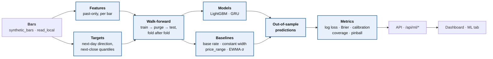
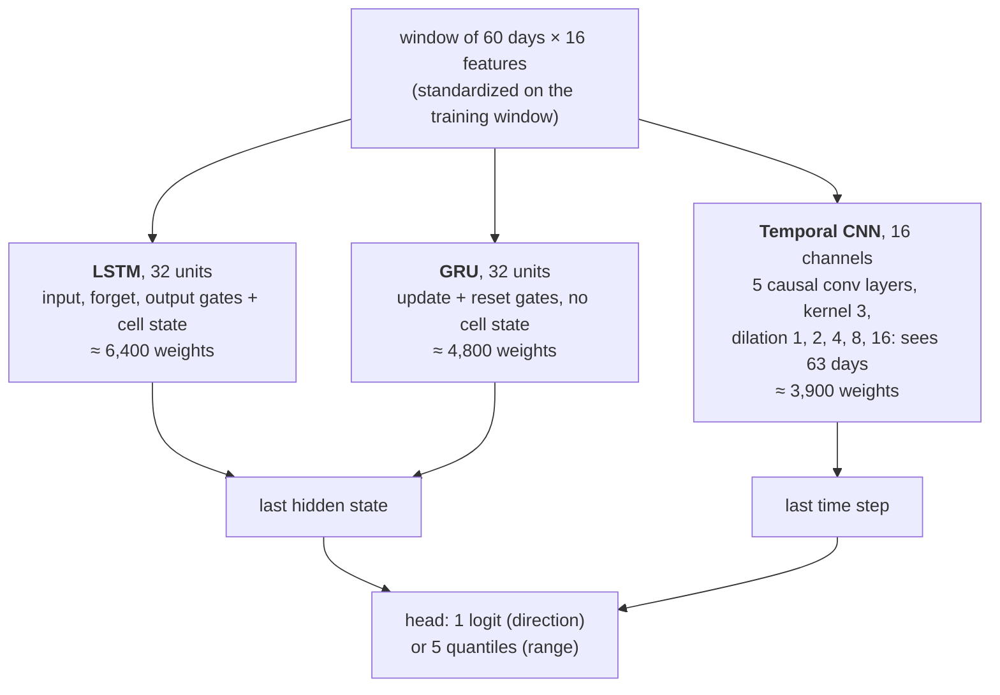
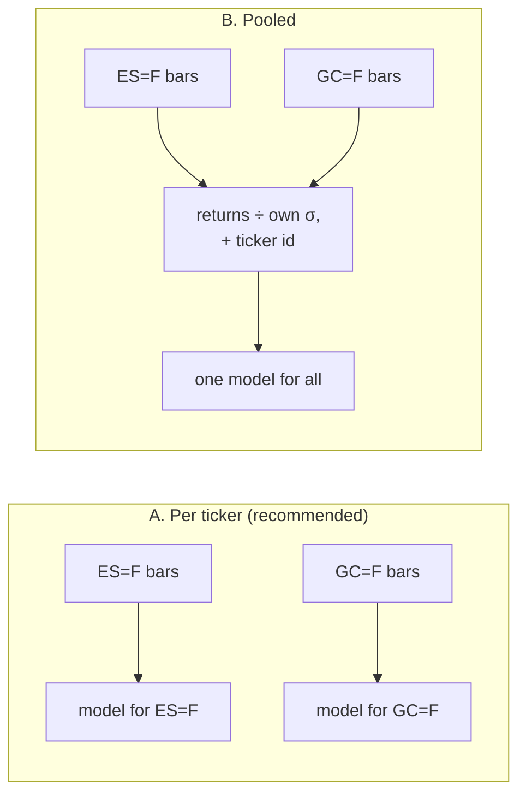

# Next-day ML forecasts plan (`dev/ml_models`)

## Picking this up

- **Branch:** `dev/ml_models`, cut from `master` at `84d11d6` (the history rewrite that closed
  `docs/data_and_license_plan.md`).
- **Working rules:**
  - One phase per request, then stop. Do not start the next phase unprompted.
  - A phase with an open design choice opens by showing the owner examples (charts or
    diagrams) and stopping for a choice, as `docs/doc_update_plan.md` did. The choice is
    recorded under *Owner's decisions*, then the phase is built.
  - Each phase is committed and pushed, and its commit is recorded in the phase table.
  - Stay within the plan. A new deliverable is proposed as a change to this plan.
  - Analysis lives only in the package. The API wraps and serializes, and the dashboard displays
    (README, *Development workflow*).
- **Setup (from Phase 2):** Python 3.12 or newer, then `pip install -e ".[ml,stats,dev]"`. PyTorch's
  default Linux wheel bundles CUDA (several GB). For the CPU wheel, install torch first:
  `pip install torch --index-url https://download.pytorch.org/whl/cpu`. All tests run offline,
  and the model tests skip when the `ml` extra is missing.
- **Real data:** Yahoo is blocked in the cloud sessions this is built in. Real-data runs happen
  on the owner's computer, after `save_all()` (or **Download all** in the dashboard) has filled
  `data/local`.
- **The charts in this plan** are made from the synthetic tickers only, by a scratch script in
  the git-ignored `dev/` (`dev/ml_plan_charts.py`). The numbers quoted beside them come from the
  same run.

## Context

The repo measures how often price moves have happened (`price_return`) and ports TradingView
indicators (`ta_tools`). The next stage asks a forecasting question: **given everything known at
today's close, what is the chance tomorrow closes higher, and what range will it trade in?**
Two model families answer it: gradient-boosted trees (LightGBM) on hand-built features, and a
sequence model (PyTorch) on a window of recent days. Both are judged against simple baselines,
out of sample, with walk-forward validation only.

Everything follows the README's development workflow: a notebook first, then a tested package
under `src/tools/`, then API endpoints and a dashboard tab.

The blue boxes are the package. The API and dashboard only call it.

## Hard rules

These come from the owner's brief. Each one is enforced by a test, not just by convention.

1. **Data.**
   - Real bars come only from Yahoo, through `save_local` / `save_all` into the git-ignored
     `data/local`, and are read with `read_local`.
   - Tests use the synthetic tickers (`synthetic_bars`) and stay offline. The yfinance stand-in
     in `tests/conftest.py` covers any Yahoo path.
   - No market data is committed, ever. The ML notebook is committed **without outputs**, so a
     run on saved data cannot leak prices into the repo, and a test checks this. Charts in
     `docs/` are of synthetic tickers only.
2. **No look-ahead.**
   - Every feature column passes the `ta_tools` truncation test (`test_no_lookahead` in
     `tests/test_ta_tools.py`): cut the bars after t, recompute, and every value at or before t
     must be unchanged.
   - The same test also runs end to end. A walk-forward prediction for bar t must not change when
     the bars after t are removed. This needs deterministic training: LightGBM with
     `deterministic=True` and one thread; torch seeded, on CPU, with deterministic algorithms.
   - Scalers and any other fitted transform are fitted on the training window only, and a test
     shows that changing test-window values leaves them unchanged.
3. **Walk-forward only, never random splits.**
   - The splitter takes the label horizon `h` and purges every training row whose label
     interval (t, t+h] reaches into the test window.
   - Validation splits for early stopping sit inside the training window and are purged the same
     way.
   - Tests check that no fold has overlapping labels, and that `h = 5` purges exactly 4 rows.
4. **Sanity checks on the synthetic tickers** are tests, and a failure is treated as a bug.
   *Evaluation* below gives the criteria and their evidence.
   - Direction models must be no better than chance.
   - Range models must beat a constant-width band.
5. **Dependencies.**
   - LightGBM and PyTorch go in a new optional extra, `ml = ["lightgbm", "torch"]`, so the base
     install stays light. They are also added to `requirements.txt` for Colab.
   - The bootstrap and the coverage tests need scipy, which is already the `stats` extra.
   - Both libraries are imported lazily, with an install hint like the one `price_return.stats`
     gives for scipy. Importing the package never needs them.

## Targets

Notation: `C_t` is the close of bar t; `r_{t+1} = C_{t+1} / C_t − 1` is tomorrow's return, the
only thing a label may look at beyond t. Days whose return spans a non-positive close (SYN-OIL on
2020-04-20, WTI in April 2020) are dropped, as `price_return.data._returns_from_closes` drops them.

### Direction: binary, or with a flat band

- **A. Binary**, `up = 1[C_{t+1} > C_t]`. The classes stay near half and half every quarter. On
  SYN-INDEX, 54.4% of next days are up.
- **B. A fixed flat band** (|r| < 0.5%, the default `win_threshold`). The flat share swings from
  38% to 80% per quarter, because it tracks volatility: calm quarters are mostly "flat". On GARCH
  data volatility can be forecast, so a model can predict "flat" from volatility alone and look
  skilful with no idea of the direction. The daily flat label correlates −0.22 with the EWMA
  volatility known at t.
- **C. A flat band scaled by volatility** (|r| < 0.25 × EWMA σ at t). The mix is stable (flat 14% to 45%
  per quarter, correlation with volatility 0.05), so "flat" means "small for the current regime".

**Recommendation: A, binary.** Log loss, Brier and calibration are cleanest for two classes, and
the baseline is the historical up-frequency. If a flat class is wanted, take C, never B, with k as
a parameter. A three-class model would add one class to the metrics and nothing to the pipeline.

### Range: quantiles of the next close, or the next high and low

- **A. Quantiles of the next close.** For each τ, the model forecasts the τ-quantile of `r_{t+1}`,
  and the band is `C_t × (1 + q_τ)`.
  - τ = 0.05, 0.1587, 0.5, 0.8413 and 0.95 give a 68% and a 90% interval, plus the median.
  - The 68% interval is the one `price_range`'s ±1σ band claims, so the two compare directly.
  - Option strikes settle against the close, as the README's Methodology notes.
  - Coverage and pinball loss are well defined, and the five quantiles are nested; crossed
    forecasts are sorted.
- **B. The next day's high and low**, as forecasts of `H_{t+1} / C_t − 1` and
  `L_{t+1} / C_t − 1` (a median and an outer level for each). This answers a different question:
  how far price travels during the day, which matters for stops and for limit orders.
  - It needs two models per level, and its baseline is not `price_range`.
  - On the synthetic tickers the wicks are drawn with a constant scale per ticker, not from the
    GARCH variance. That makes them a weaker test bed than the closes.

**Recommendation: A, next-close quantiles.** B is deferred, and would reuse everything but the
target.

## Validation: walk-forward with a purge

- The first fold trains on 3 years (756 bars). Then each fold tests the next 63 bars (a
  quarter) and retrains. That gives 32 folds on SYN-INDEX, the first testing from 2019-01-23.
- **A. Expanding window (recommended).** Each fold trains on everything before it. The synthetic
  series are stationary by construction, and about 2,700 bars per ticker is not much for a
  sequence model.
- **B. Rolling window.** Each fold trains on the last 3 years only, which adapts faster when the
  market changes. It is a parameter, so the owner's real-data runs can try both.

- A label interval is (t, t+h]. A training row overlaps the test window when `t + h > t0`, the
  first test bar. The splitter drops those **h − 1** rows.
- For the next-day targets (h = 1), the last training row's label is the first test bar's own
  return. It is known at the close of t0, when the first prediction is made, so nothing is
  purged.
- The purge exists for any longer horizon, and it is tested at h = 5, where it drops 4 rows.
- **No embargo.** Features are past-only and checked by the no-look-ahead test, so no extra
  gap is needed beyond the purge.

## Evaluation and baselines

### Direction: log loss, Brier and calibration, against the historical up-frequency

- **Baseline:** the up-frequency of every label known at t (expanding), so the baseline is
  walk-forward too.
- **Metrics:**
  - log loss;
  - Brier score, with Murphy's split into reliability, resolution and uncertainty;
  - a reliability table (forecast bins against the observed frequency, with counts), drawn as
    above.
- **Reading the chart** (SYN-INDEX, out of sample from 2019, 2,006 days):
  - The base rate scores a log loss of 0.6919 and a Brier score of 0.2494. A coin flip scores
    log(2) = 0.6931.
  - A "momentum" forecast that calls 62% after an up day and 40% after a down day is
    overconfident: its points lie far off the diagonal. It loses on both scores (0.7100 and
    0.2582).
  - On unpredictable data, being confident costs log loss. That is exactly what the sanity check
    measures.
- **Comparison:** the per-day loss difference against the baseline, with a 95% interval from the
  stationary block bootstrap already in `price_return.stats` (`stationary_bootstrap`). Its mean
  block is at least 20 days, because the losses cluster with volatility.

### Range: coverage and pinball loss, against `price_range` and a rolling-volatility band

- **Metrics:**
  - coverage of the 68% and 90% intervals, with Kupiec's test (is the miss rate right?) and
    Christoffersen's independence test (do misses cluster?);
  - mean pinball loss per τ and averaged;
  - mean interval width.
- **Baselines** (each refit at every fold from data known at t):
  - **constant width:** the empirical quantiles of all past returns;
  - **`price_range`:** `options.price_range`'s lognormal ±zσ band, with σ the trailing
    `trade_days` (250-day) standard deviation, as `latest_snapshot` supplies it;
  - **rolling volatility:** a 20-day standard deviation with normal quantiles, and an EWMA σ
    (λ = 0.94) times the past quantiles of returns divided by their own EWMA σ;
  - **GARCH oracle,** on synthetic data only: the generator's own variance recursion with its
    true parameters. No model can beat it on average. It is a ceiling, not a baseline.

SYN-INDEX, out of sample 2019-01-23 to 2026-09-29 (2,005 days):

| band | 68% coverage | 90% coverage | Kupiec p (68%) | Christoffersen p | miss after miss ÷ miss after hit | mean pinball (bp) |
|---|---|---|---|---|---|---|
| constant width | 68.3% | 90.0% | 0.95 | 1e-16 | 1.73 | 16.50 |
| `price_range` (250-day σ) | 79.2% | 92.2% | < 0.001 | 1e-12 | 1.95 | 16.89 |
| 20-day σ, normal | 72.2% | 87.5% | < 0.001 | 4e-7 | 1.47 | 16.26 |
| EWMA σ × past standardized quantiles | 68.1% | 89.5% | 0.90 | 9e-4 | 1.25 | 16.16 |
| GARCH oracle | 69.0% | 89.7% | 0.49 | 0.9 | 1.01 | 15.58 |

What this settles:

- **Coverage alone cannot tell the bands apart.**
  - The constant band covers exactly 68.3% on average, and passes Kupiec.
  - It fails independence badly: a miss is 1.73 times as likely the day after a miss. Its misses
    come in volatile spells (panel B), and its rolling coverage swings from 55% to 78%
    (panel A).
  - So both tests are reported, with pinball loss as the overall score.
- **Normal quantiles over-cover on fat tails.** `price_range` covers 79% where it claims 68%,
  because Student-t returns have more mass near zero than a normal with the same σ. Scaling the
  past *standardized* quantiles fixes the coverage (68.1%). That makes it the rolling-volatility
  baseline to beat. `price_range` stays in the table because it is what the repo uses today.
- **The gains are small.** The EWMA band beats the constant one by 2 to 8% in pinball loss on the
  five long synthetic tickers. On SYN-INDEX the bootstrap interval of the gain is [0.0%, 4.5%],
  just touching zero. SYN-LEV starts in August 2022, so it has too few test days. This shapes the
  sanity criterion below.

### The sanity checks, as tests

Why they must hold: each synthetic ticker draws i.i.d. Student-t shocks, so tomorrow's sign is
independent of the past, and the best direction forecast is the base rate. Its variance follows
GARCH(1,1) with α + β of 0.98, so volatility can be forecast, and a range model that tracks it
must beat a constant band. Each scheduled sell-off has a negative drift, but it happens once per
ticker, so a model cannot learn it before it happens.

- **Direction, no better than chance.**
  - Test: on each of the five long synthetic tickers, the bootstrap interval of
    `log loss(base rate) − log loss(model)` must not lie wholly above zero, at the 99% level so
    that five tickers × two models rarely raise a false alarm.
  - The model's mean log loss must also not undercut the base rate's by more than 0.002.
- **A positive control,** so the check is not vacuous. A model that always predicted the base rate
  would pass it trivially. So a synthetic series with a planted lag-1 sign signal must beat the
  base rate, with an interval wholly above zero.
- **A seeded leak trips it.** Adding `r_{t+1}` as a feature must fail the direction check, as must
  a splitter that keeps the purged rows on a 5-day label. The README's seeded-bug practice, kept
  as permanent tests.
- **Range, better than a constant band.**
  - On each of the five long tickers, mean pinball loss must be below the constant band's.
  - Pooled over the five, the bootstrap interval of the gain must lie wholly above zero.
  - The model's misses must cluster less than the constant band's: a lower ratio of the miss rate
    after a miss to the miss rate after a hit, on every long ticker. Passing Christoffersen's test
    outright is not required, and is reported only. The constant band fails it at 1% on all five
    long tickers (p ≤ 0.002). Even the EWMA band fails it on SYN-INDEX, SYN-TECH and SYN-OIL;
    only the GARCH oracle passes everywhere.
  - The model is also expected, but not required, to land between the EWMA band and the GARCH
    oracle. This is reported, not asserted.

## Features

Past-only, computed from the bar at t and the bars before it, in pandas and numpy. No TA-Lib, so
`ml` does not need the `ta` extra:

- returns: r_t and four lags; |r_t|;
- volatility: 20- and 60-day standard deviation, EWMA σ (λ = 0.94), Parkinson and Garman–Klass
  20-day range volatility, true range over the close;
- level: the close over its 20- and 50-day averages, a 14-day RSI;
- calendar: the day of the week.

That is about 16 columns. Each is in the no-look-ahead test. The direction and range models share
them, and the sequence model sees a window of them.

## Models

### LightGBM

- **Direction:** one `binary` model.
- **Range:** one `quantile` model per τ. Crossed forecasts are sorted, which never worsens any
  quantile's pinball loss.
- Small and regularized (about 200 trees, 15 leaves, at least 50 rows a leaf). Early stopping
  uses the last 20% of each training window, purged as above. Feature importance is reported per
  fold.

### Sequence model: LSTM, GRU or temporal CNN

- **Recommendation: GRU.** It matches an LSTM on short windows with a quarter fewer weights,
  which matters with about 2,700 rows per ticker. It has no receptive field to tune, unlike the
  temporal CNN, whose window is fixed by its dilations. The model is behind one interface, so an
  LSTM or a temporal CNN can be added later without touching the runner.
- Separate direction and range networks, trained per target, to match LightGBM. The direction
  network uses binary cross-entropy. The range network uses pinball loss summed over the five τ.
- Training: Adam, a small weight decay, early stopping on the purged validation tail, a fixed
  seed, on CPU. This size trains in seconds per fold.

### Per ticker, or pooled

- **Per ticker (recommended).** It matches how `price_return` analyses one ticker at a time, it
  keeps each ticker's sanity check independent, and nothing has to be normalized across asset
  classes.
- **Pooled** gives the sequence model about 12 times the rows, but needs volatility-normalized
  returns and a ticker identifier. Deferred, as a later phase if per-ticker models prove
  data-starved.

## Package: `src/tools/ml_models/`

Named after the branch. The name is open (see *Open judgment calls*). It is a sibling of
`price_return` and `ta_tools`, uses plain keyword arguments as `ta_tools` does, and re-exports
everything through `__init__.py` with an `__all__`, which the smoke test resolves.

| Module | Contents | Needs `ml` |
|---|---|---|
| `data.py` | bars for a ticker: `synthetic_bars`, or `read_local` for saved data | no |
| `targets.py` | next-day direction (with an optional scaled flat band), next-close return quantile targets | no |
| `features.py` | the feature frame | no |
| `split.py` | walk-forward folds with the purge | no |
| `baselines.py` | base rate, constant width, `price_range`, 20-day and EWMA bands | no |
| `metrics.py` | log loss, Brier and its decomposition, reliability table, coverage, Kupiec, Christoffersen, pinball | scipy for p-values |
| `gbm.py` | LightGBM direction and quantile models | yes |
| `sequence.py` | the GRU (or the chosen network), with the same interface | yes |
| `evaluate.py` | runs any model or baseline through the folds; out-of-sample predictions; metric tables; bootstrap comparisons | no (yes for the models) |
| `viz.py` | Plotly charts: reliability, coverage and misses, bands on price, fold timeline, feature importance | no |

## Phases

| # | Phase | Deliverable |
|---|---|---|
| **0** ✅ | Plan | this document and its example charts; the owner's choices — **done, `e432564`** (choices pending) |
| **1** | Notebook | `notebooks/ml_next_day.ipynb`, committed without outputs: targets, features, walk-forward, baselines, LightGBM and a GRU on the synthetic tickers (saved data when the owner runs it). It confirms the sanity checks hold before anything is formalized. |
| **2** | Package core (no ML libraries) | `ml_models` with `data`, `targets`, `features`, `split`, `baselines`, `metrics`; the `ml` extra in `pyproject.toml` and `requirements.txt`. Tests: no-look-ahead per feature, the purge, metrics against hand-worked examples and scipy, the baselines' sanity (the EWMA band beats the constant one when pooled), the notebook-has-no-outputs check. |
| **3** | LightGBM | `gbm.py`, `evaluate.py`, `viz.py`; both sanity checks, the positive control, the seeded leaks and the end-to-end no-look-ahead test, on LightGBM |
| **4** | Sequence model | `sequence.py` (GRU, or the owner's choice) through the same runner and the same tests |
| **5** | API | `/api/ml/*` endpoints: run on request and cached, 501 without the `ml` extra; `docs/api.md` rows, which the routes test requires |
| **6** | Dashboard | an **ML forecasts** tab with direction and range sections, run on request; an end-to-end test on the synthetic data; a screenshot in `docs/dashboard.md` |
| **7** | Wrap-up | README: Setup (the extra), layout, Package API, Tests, notebook table, changelog. The owner runs the notebook on saved data. Checks in full; a PR when asked. |

The test suite stays fast: LightGBM and GRU tests use small models and few folds, and run on
two or three synthetic tickers where five are not needed. A slow mark is added only if a phase
measures the suite past about a minute.

## Owner's decisions

Pending. The recommendations above, for the owner to confirm or change:

1. Direction target: **binary** (or a volatility-scaled flat band, never a fixed one).
2. Range target: **next-close quantiles** at 5%, 15.9%, 50%, 84.1%, 95% (high/low deferred).
3. Walk-forward: **expanding**, 3 years before the first fold, retrain every **63** bars.
4. Sequence model: **GRU**.
5. Training: **per ticker** (pooled deferred).
6. Package name: **`ml_models`**.
7. Sanity tests: direction at the **99%** level with a 0.002 log-loss margin; range pooled at 95%,
   plus less miss clustering than the constant band.

## Open judgment calls

- **Real-data expectations.** On real tickers the base rate may be hard to beat too. A direction
  model that does beat it on real data, but not on synthetic, is the interesting case, and it
  needs more than one ticker and period before it is believed. The plan reports; it does not
  promise an edge.
- **Intraday or multi-day horizons** reuse the purge (h > 1) and are out of scope until asked.
- **Calibration after the fact** (Platt or isotonic on the training window) is added only if the
  reliability tables show the models are systematically miscalibrated.

## Deferred, with reasons

- **High/low range target:** a second question with its own baseline. It reuses everything but
  the target.
- **Pooled multi-ticker training:** needs cross-asset normalization. Worth it only if per-ticker
  models are short of data.
- **LSTM and temporal CNN:** behind the same interface as the GRU, if the GRU disappoints.
- **Hosting and scheduled retraining:** the dashboard POC's hosting step, not this branch.
