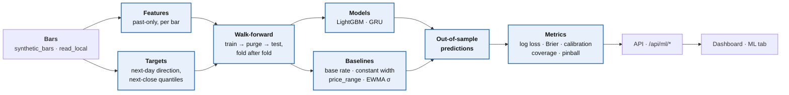
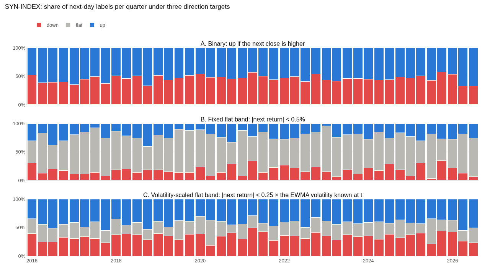
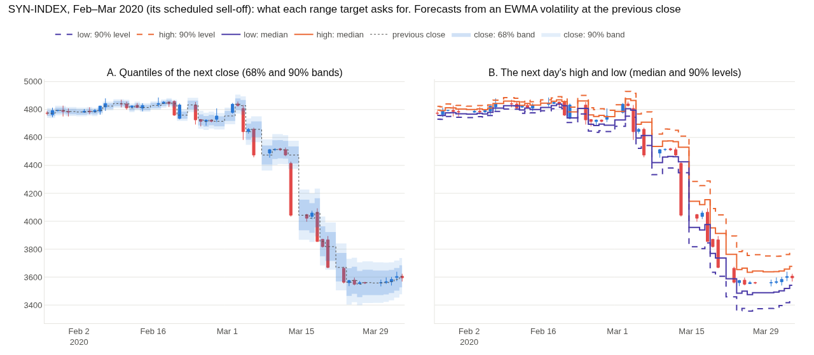
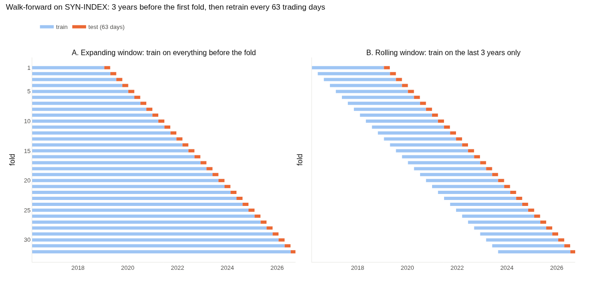
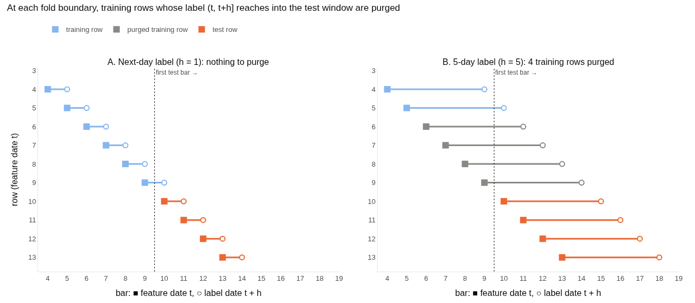
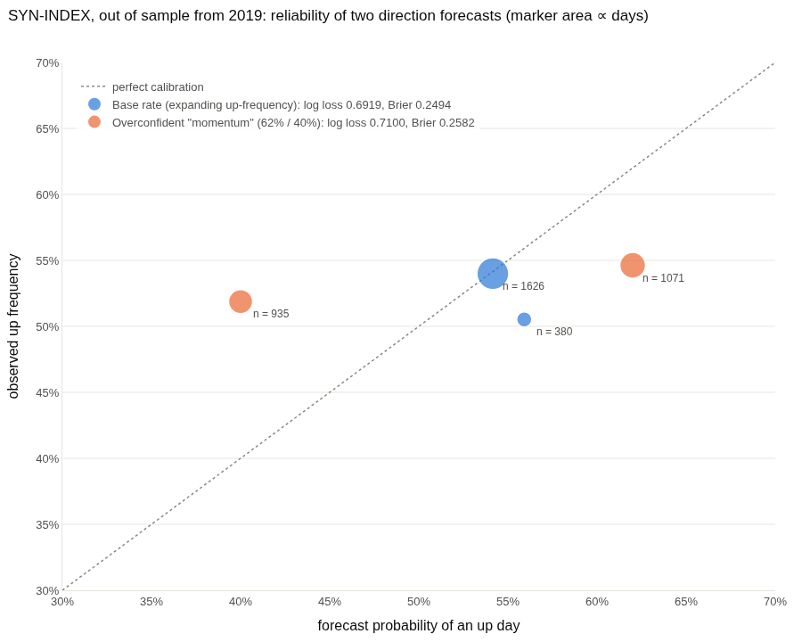
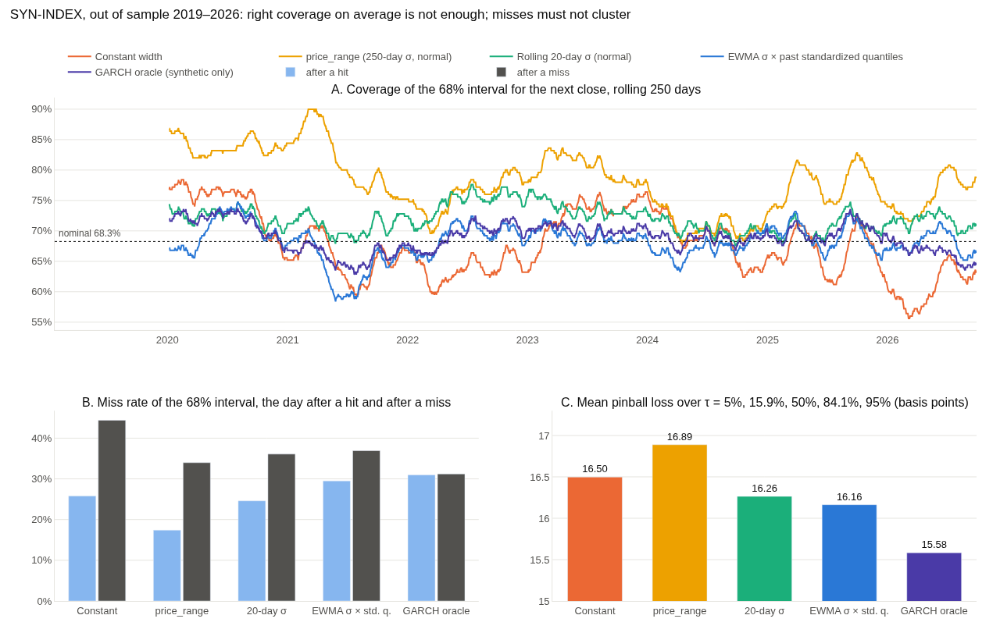
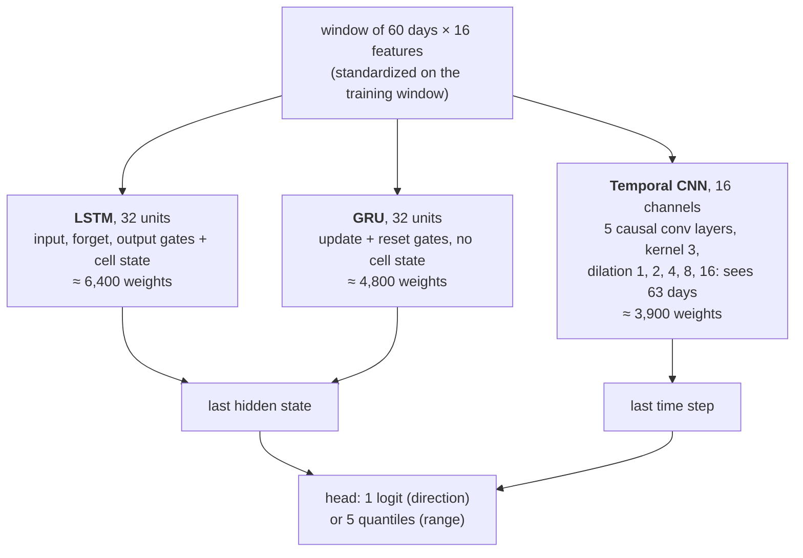
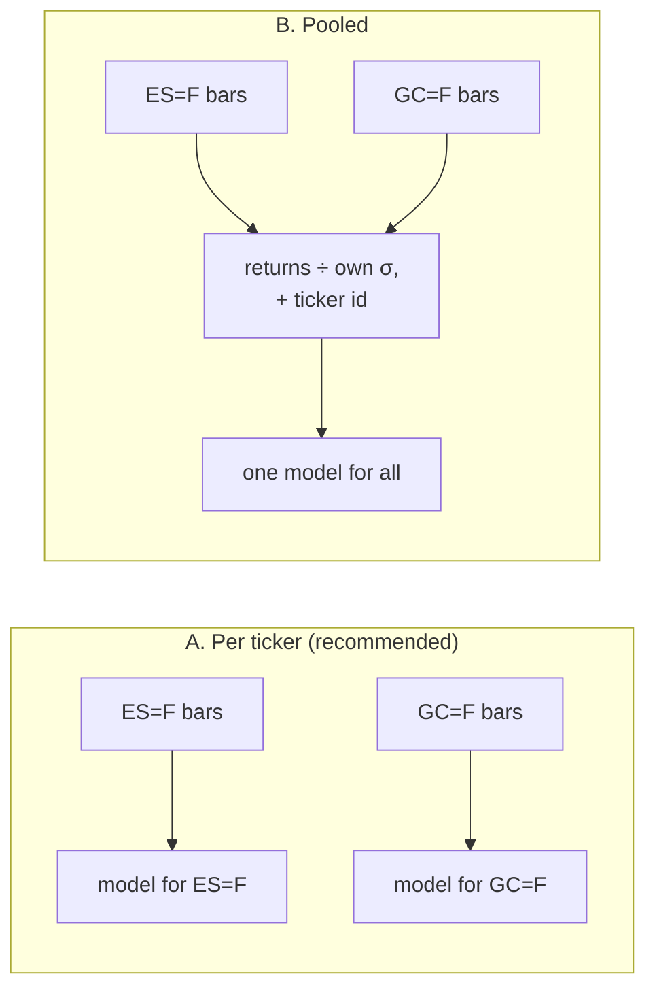

# Next-day ML forecasts plan (`dev/ml_models`)

## Picking this up

- **Branch:** `dev/ml_models`, cut from `master` at `84d11d6` (the history rewrite that closed
  `docs/data_and_license_plan.md`).
- **Working rules:**
  - One phase per request, then stop. Do not start the next phase unprompted.
  - A phase with an open design choice opens by showing the owner examples (charts or
    diagrams) and stopping for a choice, as `docs/doc_update_plan.md` did. The choice is
    recorded under *Owner's decisions*, then the phase is built.
  - Each phase is committed and pushed, and its commit is recorded in the phase table.
  - Stay within the plan. A new deliverable is proposed as a change to this plan.
  - Analysis lives only in the package. The API wraps and serializes, and the dashboard displays
    (README, *Development workflow*).
- **Setup (from Phase 2):** Python 3.12 or newer, then `pip install -e ".[ml,stats,dev]"`. PyTorch's
  default Linux wheel bundles CUDA (several GB). For the CPU wheel, install torch first:
  `pip install torch --index-url https://download.pytorch.org/whl/cpu`. All tests run offline,
  and the model tests skip when the `ml` extra is missing. The model tests are marked `slow`:
  `pytest` runs them, `pytest -m "not slow"` leaves them out for a quick run. The GRU's other
  two input sets on every check are marked `exhaustive` and run only with `pytest -m exhaustive`.
- **Real data:** Yahoo is blocked in the cloud sessions this is built in. Real-data runs happen
  on the owner's computer, after `save_all()` (or **Download all** in the dashboard) has filled
  `data/local`.
- **The charts in this plan** are made from the synthetic tickers only, by
  `python scripts/ml_plan_charts.py` (needs the `stats` extra and kaleido). The numbers quoted
  beside them are the ones it prints.

## Context

The repo measures how often price moves have happened (`price_return`) and ports TradingView
indicators (`ta_tools`). The next stage asks a forecasting question: **given everything known at
today's close, what is the chance tomorrow closes higher, and what range will it trade in?**
Two model families answer it: gradient-boosted trees (LightGBM) on hand-built features, and a
sequence model (PyTorch) on a window of recent days. Both are judged against simple baselines,
out of sample, with walk-forward validation only.

Everything follows the README's development workflow: a notebook first, then a tested package
under `src/tools/`, then API endpoints and a dashboard tab.

The blue boxes are the package. The API and dashboard only call it.

## Hard rules

These come from the owner's brief. Each one is enforced by a test, not just by convention.

1. **Data.**
   - Real bars come only from Yahoo, through `save_local` / `save_all` into the git-ignored
     `data/local`, and are read with `read_local`.
   - Tests use the synthetic tickers (`synthetic_bars`) and stay offline. The yfinance stand-in
     in `tests/conftest.py` covers any Yahoo path.
   - No market data is committed, ever. The ML notebook is committed **without outputs**, so a
     run on saved data cannot leak prices into the repo, and a test checks this. Charts in
     `docs/` are of synthetic tickers only.
2. **No look-ahead.**
   - Every feature column passes the `ta_tools` truncation test (`test_no_lookahead` in
     `tests/test_ta_tools.py`): cut the bars after t, recompute, and every value at or before t
     must be unchanged.
   - The same test also runs end to end. A walk-forward prediction for bar t must not change when
     the bars after t are removed. This needs deterministic training: LightGBM with
     `deterministic=True` and one thread; torch seeded, on CPU, with deterministic algorithms.
   - Scalers and any other fitted transform are fitted on the training window only, and a test
     shows that changing test-window values leaves them unchanged.
3. **Walk-forward only, never random splits.**
   - The splitter takes the label horizon `h` and purges every training row whose label
     interval (t, t+h] reaches into the test window.
   - Validation splits for early stopping sit inside the training window and are purged the same
     way.
   - Tests check that no fold has overlapping labels, and that `h = 5` purges exactly 4 rows.
4. **Sanity checks on the synthetic tickers** are tests, and a failure is treated as a bug.
   *Evaluation* below gives the criteria and their evidence.
   - Direction models must be no better than chance.
   - Range models must beat a constant-width band.
5. **Dependencies.**
   - LightGBM and PyTorch go in a new optional extra, `ml = ["lightgbm", "torch"]`, so the base
     install stays light. They are also added to `requirements.txt` for Colab.
   - The bootstrap and the coverage tests need scipy, which is already the `stats` extra.
   - Both libraries are imported lazily, with an install hint like the one `price_return.stats`
     gives for scipy. Importing the package never needs them.

## Targets

Notation: `C_t` is the close of bar t; `r_{t+1} = C_{t+1} / C_t − 1` is tomorrow's return, the
only thing a label may look at beyond t. Days whose return spans a non-positive close (SYN-OIL on
2020-04-20, WTI in April 2020) are dropped, as `price_return.data._returns_from_closes` drops them.

### Direction: binary, or with a flat band

> **Superseded (2026-10-03):** the owner replaced the up/down target with **win/draw/loss** at a
> fixed ±0.2% threshold, forecast by its own model (decisions 11 to 15, and the *Two models*
> notes). The comparison below is kept because it is why the W/D/L checks use a volatility
> baseline: a fixed band's draw share tracks volatility.

- **A. Binary**, `up = 1[C_{t+1} > C_t]`. The classes stay near half and half every quarter. On
  SYN-INDEX, 54.4% of next days are up.
- **B. A fixed flat band** (|r| < 0.5%, the default `win_threshold`). The flat share swings from
  38% to 80% per quarter, because it tracks volatility: calm quarters are mostly "flat". On GARCH
  data volatility can be forecast, so a model can predict "flat" from volatility alone and look
  skilful with no idea of the direction. The daily flat label correlates −0.22 with the EWMA
  volatility known at t.
- **C. A flat band scaled by volatility** (|r| < 0.25 × EWMA σ at t). The mix is stable (flat 14% to 45%
  per quarter, correlation with volatility 0.05), so "flat" means "small for the current regime".

**Recommendation: A, binary.** Log loss, Brier and calibration are cleanest for two classes, and
the baseline is the historical up-frequency. If a flat class is wanted, take C, never B, with k as
a parameter. A three-class model would add one class to the metrics and nothing to the pipeline.

### Range: quantiles of the next close, or the next high and low

- **A. Quantiles of the next close.** For each τ, the model forecasts the τ-quantile of `r_{t+1}`,
  and the band is `C_t × (1 + q_τ)`.
  - τ = 0.05, 0.1587, 0.5, 0.8413 and 0.95 give a 68% and a 90% interval, plus the median.
  - The 68% interval is the one `price_range`'s ±1σ band claims, so the two compare directly.
  - Option strikes settle against the close, as the README's Methodology notes.
  - Coverage and pinball loss are well defined, and the five quantiles are nested; crossed
    forecasts are sorted.
- **B. The next day's high and low**, as forecasts of `H_{t+1} / C_t − 1` and
  `L_{t+1} / C_t − 1` (a median and an outer level for each). This answers a different question:
  how far price travels during the day, which matters for stops and for limit orders.
  - It needs two models per level, and its baseline is not `price_range`.
  - On the synthetic tickers the wicks are drawn with a constant scale per ticker, not from the
    GARCH variance. That makes them a weaker test bed than the closes.

**Recommendation: A, next-close quantiles.** B is deferred, and would reuse everything but the
target.

## Validation: walk-forward with a purge

- The first fold trains on 3 years (756 bars). Then each fold tests the next 63 bars (a
  quarter) and retrains. That gives 32 folds on SYN-INDEX, the first testing from 2019-01-23.
- **A. Expanding window (recommended).** Each fold trains on everything before it. The synthetic
  series are stationary by construction, and about 2,700 bars per ticker is not much for a
  sequence model.
- **B. Rolling window.** Each fold trains on the last 3 years only, which adapts faster when the
  market changes. It is a parameter, so the owner's real-data runs can try both.

- A label interval is (t, t+h]. A training row overlaps the test window when `t + h > t0`, the
  first test bar. The splitter drops those **h − 1** rows.
- For the next-day targets (h = 1), the last training row's label is the first test bar's own
  return. It is known at the close of t0, when the first prediction is made, so nothing is
  purged.
- The purge exists for any longer horizon, and it is tested at h = 5, where it drops 4 rows.
- **No embargo.** Features are past-only and checked by the no-look-ahead test, so no extra
  gap is needed beyond the purge.

## Evaluation and baselines

### Direction: log loss, Brier and calibration, against the historical up-frequency

- **Baseline:** the up-frequency of every label known at t (expanding), so the baseline is
  walk-forward too.
- **Metrics:**
  - log loss;
  - Brier score, with Murphy's split into reliability, resolution and uncertainty;
  - a reliability table (forecast bins against the observed frequency, with counts), drawn as
    above.
- **Reading the chart** (SYN-INDEX, out of sample from 2019, 2,006 days):
  - The base rate scores a log loss of 0.6919 and a Brier score of 0.2494. A coin flip scores
    log(2) = 0.6931.
  - A "momentum" forecast that calls 62% after an up day and 40% after a down day is
    overconfident: its points lie far off the diagonal. It loses on both scores (0.7100 and
    0.2582).
  - On unpredictable data, being confident costs log loss. That is exactly what the sanity check
    measures.
- **Comparison:** the per-day loss difference against the baseline, with a 95% interval from the
  stationary block bootstrap already in `price_return.stats` (`stationary_bootstrap`). Its mean
  block is at least 20 days, because the losses cluster with volatility.

### Range: coverage and pinball loss, against `price_range` and a rolling-volatility band

- **Metrics:**
  - coverage of the 68% and 90% intervals, with Kupiec's test (is the miss rate right?) and
    Christoffersen's independence test (do misses cluster?);
  - mean pinball loss per τ and averaged;
  - mean interval width.
- **Baselines** (each refit at every fold from data known at t):
  - **constant width:** the empirical quantiles of all past returns;
  - **`price_range`:** `options.price_range`'s lognormal ±zσ band, with σ the trailing
    `trade_days` (250-day) standard deviation, as `latest_snapshot` supplies it;
  - **rolling volatility:** a 20-day standard deviation with normal quantiles, and an EWMA σ
    (λ = 0.94) times the past quantiles of returns divided by their own EWMA σ;
  - **GARCH oracle,** on synthetic data only: the generator's own variance recursion with its
    true parameters. No model can beat it on average. It is a ceiling, not a baseline.

SYN-INDEX, out of sample 2019-01-23 to 2026-09-29 (2,005 days):

| band | 68% coverage | 90% coverage | Kupiec p (68%) | Christoffersen p | miss after miss ÷ miss after hit | mean pinball (bp) |
|---|---|---|---|---|---|---|
| constant width | 68.3% | 90.0% | 0.95 | 1e-16 | 1.73 | 16.50 |
| `price_range` (250-day σ) | 79.2% | 92.2% | < 0.001 | 1e-12 | 1.95 | 16.89 |
| 20-day σ, normal | 72.2% | 87.5% | < 0.001 | 4e-7 | 1.47 | 16.26 |
| EWMA σ × past standardized quantiles | 68.1% | 89.5% | 0.90 | 9e-4 | 1.25 | 16.16 |
| GARCH oracle | 69.0% | 89.7% | 0.49 | 0.9 | 1.01 | 15.58 |

What this settles:

- **Coverage alone cannot tell the bands apart.**
  - The constant band covers exactly 68.3% on average, and passes Kupiec.
  - It fails independence badly: a miss is 1.73 times as likely the day after a miss. Its misses
    come in volatile spells (panel B), and its rolling coverage swings from 55% to 78%
    (panel A).
  - So both tests are reported, with pinball loss as the overall score.
- **Normal quantiles over-cover on fat tails.** `price_range` covers 79% where it claims 68%,
  because Student-t returns have more mass near zero than a normal with the same σ. Scaling the
  past *standardized* quantiles fixes the coverage (68.1%). That makes it the rolling-volatility
  baseline to beat. `price_range` stays in the table because it is what the repo uses today.
- **The gains are small.** The EWMA band beats the constant one by 2 to 8% in pinball loss on the
  five long synthetic tickers. On SYN-INDEX the bootstrap interval of the gain is [0.0%, 4.5%],
  just touching zero. SYN-LEV starts in August 2022, so it has too few test days. This shapes the
  sanity criterion below.

### The sanity checks, as tests

Why they must hold: each synthetic ticker draws i.i.d. Student-t shocks, so tomorrow's sign is
independent of the past, and the best direction forecast is the base rate. Its variance follows
GARCH(1,1) with α + β of 0.98, so volatility can be forecast, and a range model that tracks it
must beat a constant band. Each scheduled sell-off has a negative drift, but it happens once per
ticker, so a model cannot learn it before it happens.

- **Direction, no better than chance** (the up/down form, until 2026-10-03; the W/D/L form that
  replaced it is in the *Two models* notes).
  - Test: on each of the five long synthetic tickers, the bootstrap interval of
    `log loss(base rate) − log loss(model)` must not lie wholly above zero, at the 99% level so
    that five tickers × two models rarely raise a false alarm.
  - The model's mean log loss must also not undercut the base rate's by more than 0.002.
- **A positive control,** so the check is not vacuous. A model that always predicted the base rate
  would pass it trivially. So a synthetic series with a planted lag-1 sign signal (each sign
  repeats the last 60% of the time) must beat the base rate, with an interval wholly above zero.
- **Seeded leaks trip it.** Adding `r_{t+1}` as a feature must fail the direction check, as must a
  feature from a centred 5-day window, a realistic look-ahead bug that carries `r_{t+1}` and
  `r_{t+2}`. The README's seeded-bug practice, kept as permanent tests. (The plan first named a
  splitter that keeps the purged rows on a 5-day label. Phase 3 measured that it cannot trip an
  outcome check, so the purge is tested structurally instead; see the Phase 3 notes.)
- **Range, better than a constant band.**
  - On each of the five long tickers, mean pinball loss must be below the constant band's.
  - Pooled over the five, the bootstrap interval of the gain must lie wholly above zero.
  - The model's misses must cluster less than the constant band's: a lower ratio of the miss rate
    after a miss to the miss rate after a hit, on every long ticker. Passing Christoffersen's test
    outright is not required, and is reported only. The constant band fails it at 1% on all five
    long tickers (p ≤ 0.002). Even the EWMA band fails it on SYN-INDEX, SYN-TECH and SYN-OIL;
    only the GARCH oracle passes everywhere.
  - The model is also expected, but not required, to land between the EWMA band and the GARCH
    oracle. This is reported, not asserted.

## Features

Past-only, computed from the bar at t and the bars before it, in pandas and numpy. No TA-Lib, so
`ml` does not need the `ta` extra:

- returns: r_t and four lags; |r_t|;
- volatility: 20- and 60-day standard deviation, EWMA σ (λ = 0.94), Parkinson and Garman–Klass
  20-day range volatility, true range over the close;
- level: the close over its 20- and 50-day averages, a 14-day RSI;
- calendar: the day of the week.

- outcomes (added 2026-10-03): today's win/draw/loss `wdl` (+1 above +0.2%, −1 below −0.2%,
  else 0) and `streak`, the signed run of wins (+) or losses (−) ending today, capped at ±10 and
  reset to 0 by a draw.

That is 18 columns. Each is in the no-look-ahead test. The win/draw/loss and return models share
them, and the sequence model sees a window of them (or of a subset, its input sets).

## Models

### LightGBM

- **Win/draw/loss** (`LightGBMWDLModel`, from 2026-10-03; it replaced the `binary` up/down
  model): one `multiclass` model with three classes.
- **Return** (`LightGBMReturnModel`): one `quantile` model per τ, whose median is the point
  forecast, fitted to the standardized return `r_{t+1} / σ_t` (σ_t the
  EWMA volatility at t) and scaled back by σ_t; Phase 1 found raw returns under-cover. Crossed
  forecasts are sorted, which never worsens any quantile's pinball loss.
- Small and regularized (up to 300 trees at a learning rate of 0.03, 15 leaves, at least 50 rows a
  leaf). Early stopping
  uses the last 20% of each training window, purged as above. Feature importance is reported per
  fold.

### Sequence model: LSTM, GRU or temporal CNN

- **Recommendation: GRU.** It matches an LSTM on short windows with a quarter fewer weights,
  which matters with about 2,700 rows per ticker. It has no receptive field to tune, unlike the
  temporal CNN, whose window is fixed by its dilations. The model is behind one interface, so an
  LSTM or a temporal CNN can be added later without touching the runner.
- Separate direction and range networks, trained per target, to match LightGBM. The direction
  network uses binary cross-entropy. The range network uses pinball loss averaged over the five
  τ, on the same standardized return as LightGBM's.
- **Recalibrated range forecasts** (owner's decision, Phase 4). Each τ's forecast is shifted by
  the τ-quantile of the network's own errors on the validation tail. Uncorrected, the intervals
  were too narrow; see the Phase 4 notes.
- **Three input sets, kept until a model is trained on real data** (owner's decision, Phase 4):
  - `'returns_range'`, each day's return and true range: the provisional default;
  - `'returns'`, the return alone;
  - `'features'`, the 16 features the diagram shows. On this data size that set finds no
    planted signal.
- Training: Adam, a small weight decay, early stopping on the purged validation tail, a fixed
  seed, on CPU. In Phase 1 this took about 2 s per fold and network (four cores).

### Per ticker, or pooled

- **Per ticker (recommended).** It matches how `price_return` analyses one ticker at a time, it
  keeps each ticker's sanity check independent, and nothing has to be normalized across asset
  classes.
- **Pooled** gives the sequence model about 12 times the rows, but needs volatility-normalized
  returns and a ticker identifier. Deferred, as a later phase if per-ticker models prove
  data-starved.

## Package: `src/tools/ml_models/`

Named after the branch. The name is open (see *Open judgment calls*). It is a sibling of
`price_return` and `ta_tools`, uses plain keyword arguments as `ta_tools` does, and re-exports
everything through `__init__.py` with an `__all__`, which the smoke test resolves.

| Module | Contents | Needs `ml` |
|---|---|---|
| `data.py` | `ticker_bars`: synthetic bars, or saved ones from `data/local` (never a download); `bar_returns` | no |
| `targets.py` | `TAUS`; `next_return`, `next_wdl`; `dataset`, the modelling frame | no |
| `features.py` | `FEATURES`, `features`; `WDL_THRESHOLD`, `STREAK_CAP`, `win_draw_loss`, `streak`; `ewma_vol`, `wilder_rsi` | no |
| `split.py` | `walk_forward` folds with the purge; `purged_tail` for early stopping | no |
| `baselines.py` | `wdl_baselines` (class frequencies, and a volatility baseline); `range_baselines`: constant width, `price_range`, 20-day and EWMA bands | no |
| `metrics.py` | log loss, Brier and its decomposition, their multiclass forms, reliability table, coverage, Kupiec, Christoffersen, pinball | scipy for p-values |
| `gbm.py` | `LightGBMReturnModel` (one quantile model per τ, on standardized returns) and `LightGBMWDLModel` (multiclass) | yes |
| `sequence.py` | `GRUReturnModel` and `GRUWDLModel`, with the same interfaces | yes |
| `evaluate.py` | `walk_forward_forecasts`, `evaluate`, `evaluate_many` (tickers in parallel); `wdl_scores`, `wdl_check`, `point_scores`, `range_table`, `range_check` (the sanity checks); `feature_importance`; `planted_signal_bars` | no (yes for the models) |
| `viz.py` | Plotly charts: W/D/L reliability, rolling coverage, forecast bands (with the median) on candles, folds, feature importance, pinball against the constant band | no |

## Phases

| # | Phase | Deliverable |
|---|---|---|
| **0** ✅ | Plan | this document and its example charts; the owner's choices — **done, `e432564`** (choices confirmed 2026-10-02) |
| **1** ✅ | Notebook | `notebooks/ml_next_day.ipynb`, committed without outputs: targets, features, walk-forward, baselines, LightGBM and a GRU on the synthetic tickers (saved data when the owner runs it). It confirms the sanity checks hold before anything is formalized. — **done, `2559ec2`** |
| **2** ✅ | Package core (no ML libraries) | `ml_models` with `data`, `targets`, `features`, `split`, `baselines`, `metrics`; the `ml` extra in `pyproject.toml` and `requirements.txt`. Tests: no-look-ahead per feature, the purge, metrics against hand-worked examples and scipy, the baselines' sanity (the EWMA band beats the constant one when pooled), the notebook-has-no-outputs check. — **done, `879d0cf`** |
| **3** ✅ | LightGBM | `gbm.py`, `evaluate.py`, `viz.py`; both sanity checks, the positive control, the seeded leaks and the end-to-end no-look-ahead test, on LightGBM; the notebook moved onto the package (owner's agreement, 2026-10-02) — **done, `8265b41`, `75a4397`** |
| **4** ✅ | Sequence model | `sequence.py` (GRU, or the owner's choice) through the same runner and the same tests; recalibrated ranges and three input sets (owner's decisions, Phase 4) — **done, `1cbc9dc`, `031e256`, `446dc4a`, `40afeb3`** |
| **4b** | Two models, win/draw/loss | the up/down model replaced by a W/D/L model; the `wdl` and `streak` features; return and W/D/L as separate models for LightGBM and the GRU; the notebook and tests moved over (owner's request, 2026-10-03) — **done, see the *Two models* notes** |
| **5** | API | `/api/ml/*` endpoints: run on request and cached, 501 without the `ml` extra; `docs/api.md` rows, which the routes test requires |
| **6** | Dashboard | an **ML forecasts** tab with win/draw/loss and return sections, run on request; an end-to-end test on the synthetic data; a screenshot in `docs/dashboard.md` |
| **7** | Wrap-up | README: Setup (the extra), layout, Package API, Tests, notebook table, changelog. The owner runs the notebook on saved data. Checks in full; a PR when asked. |

The test suite stays fast: LightGBM and GRU tests use small models and few folds, and run on
two or three synthetic tickers where five are not needed. A slow mark is added only if a phase
measures the suite past about a minute. Phase 3 did: the LightGBM sanity checks need the five
long tickers, so `tests/test_ml_gbm.py` is marked `slow`. It still runs with a plain `pytest`.
The GRU's tests (`tests/test_ml_sequence.py`) are marked `slow` too, and retrain every 252 rows
instead of 63, over the same test days (owner's decision, Phase 4).

## Two models: win/draw/loss and the return (Phase 4b notes)

The owner's request of 2026-10-03: a win/draw/loss outcome with a 0.2% threshold, a streak feature
of up to 10 days, and a forecast of the win/draw/loss besides the return, as **two separate
models**: one forecasting tomorrow's return (a point forecast and a range), the other tomorrow's
win/draw/loss. The up/down model is gone (decisions 11 to 15).

- **Built:**
  - `features.win_draw_loss` and `features.streak`, and the `wdl` and `streak` columns of
    `FEATURES` (18 now). A return exactly at the threshold is a draw. Both are in the per-feature
    no-look-ahead test, and `wdl` at t equals the label `y_wdl` at t − 1.
  - `targets.next_wdl` and the `y_wdl` column; `dataset(bars, wdl_threshold)` records the
    threshold in `frame.attrs`. `next_direction` and `y_up` are removed.
  - `baselines.wdl_baselines`, two of them:
    - **frequencies:** the training window's class shares, each count plus a half;
    - **volatility:** the share of training days whose standardized return `r / σ_ewma` falls
      in each class once scaled by today's σ, against the threshold. It is what volatility alone
      says about a draw.
  - `metrics.multiclass_log_loss` and `multiclass_brier`.
  - `gbm.LightGBMReturnModel` and `LightGBMWDLModel` (multiclass), and `sequence.GRUReturnModel`
    (recalibrated, as before) and `GRUWDLModel` (cross-entropy, softmax), each with a `target`
    the runner dispatches on. `Forecasts` carries `bands` and `y_ret` for a return model, `wdl`
    and `y_wdl` for a W/D/L model, and `point()`, the median.
  - `evaluate.wdl_scores`, `wdl_check` and `point_scores`; `viz.plot_wdl_reliability`; the
    forecast-bands chart draws the median.
- **The checks,** on the five long synthetic tickers:
  - **W/D/L no better than volatility,** per ticker: the 99% interval of
    `log loss(volatility baseline) − log loss(model)` must not lie wholly above zero, and the gain
    must be at most 0.015. A fixed threshold makes draws likelier in calm spells, so a model may
    use volatility; the sign stays unforecastable. The margin is not the up/down model's 0.002:
    the volatility baseline uses EWMA volatility, which is not the best there is. The generator's
    own GARCH volatility, put through its Student-t, beats it by 0.014 on SYN-INDEX, 0.008 on
    SYN-TECH, 0.006 on SYN-GOLD, 0.005 on SYN-OIL and 0.001 on SYN-FX. A model that forecasts
    volatility better than EWMA may land up to there, and the margin sits just past it.
  - **W/D/L beats the class frequencies,** pooled at 95%; and, for the GRU, does not beat the
    volatility baseline pooled.
  - **The point forecast** (the median) is no better than the EWMA band's median: the 99%
    interval of the mean-absolute-error gain is not wholly above zero, and the gain is at most 1%
    of that median's error.
  - **The range** check is unchanged.
  - **Controls:** the planted signal now repeats each sign **65%** of the time. At 60% the W/D/L
    model did not find it reliably: draws are 29% of the planted series' days (15% on SYN-OIL to
    48% on SYN-FX among the long tickers) and dilute a sign signal, and the volatility baseline
    is a harder bar than the base rate. At 65% LightGBM gains 0.029 (99% interval from 0.015). The two leaks (`r_{t+1}`, a centred 5-day window) must fail
    the W/D/L check and beat the volatility baseline outright. The end-to-end no-look-ahead test
    covers both LightGBM models.
- **Measured** (step 63 for LightGBM, 252 for the GRU, as in the tests):

  | | LightGBM | GRU (`returns_range`) |
  |---|---|---|
  | W/D/L gain over volatility, per ticker (INDEX, TECH, GOLD, FX, OIL) | −0.0006, −0.0044, −0.0094, −0.0080, −0.0097 | +0.0045, −0.0005, −0.0083, −0.0122, +0.0023 |
  | W/D/L gain over frequencies, pooled (95%) | +0.0041 [0.0014, 0.0069] | +0.0083 [0.0047, 0.0121] |
  | Point forecast no better than the EWMA median | all five | all five |
  | Range gain over the constant band, pooled (95%) | 5.1% [3.6, 6.8] | 4.6% [3.2, 6.4] |
  | Planted signal (65%): gain over volatility, 99% lower bound | 0.029, 0.015 | 0.020, 0.005 |

  The volatility baseline itself beats the frequencies on all five tickers (pooled +0.0105
  [0.0059, 0.0153]); LightGBM's W/D/L model leans on the volatility features (`vol_20`,
  `vol_ewma`, `vol_parkinson`, `abs_ret` lead its gain importance). The GRU's two positive
  per-ticker gains are inside both intervals and the margin.
- **The GRU's input sets:** all three find the planted signal at 65%: `returns_range` gains
  0.020, `returns` 0.016, and `features` (now 18 columns) 0.018, each with a 99% interval above
  zero. The Phase 4 finding that the 16 features found no signal was for the up/down model at
  60%; its strict expected-failure test is dropped. On the five long tickers (step 252), all
  three pass the required checks, but `returns` alone does not beat the class frequencies
  (pooled −0.0010, 95% interval −0.0032 to +0.0014): from returns alone the GRU learns too
  little volatility to help with draws. `returns_range` gains +0.0083 and `features` +0.0053
  (from +0.0006). The exhaustive test reports this for `returns` rather than requiring it, and
  it counts against `returns` when the input set is chosen on real data.
- **The notebook** (`notebooks/ml_next_day.ipynb`) is rebuilt for the two models: data and the
  W/D/L shares and longest streaks per ticker, the features and labels side by side, both
  LightGBM models, the three GRU input sets, the checks, the W/D/L reliability and the bands
  with their median, and the controls. It runs in about 8 minutes on four cores.
- **Not rerun:** `docs/images/ml/gru_recalibration.png` was made with the 16 features; the
  script now uses the 18, so a rerun would differ slightly.

## Phase 4 notes

- **Built:**
  - `sequence.GRUModel`, the notebook's GRU moved into the package. It has the same
    `direction()` and `quantiles()` interface as `LightGBMModel`, imports PyTorch only when a
    model is fitted, and leaves PyTorch's thread count and deterministic flag as it found them.
  - `windows`, `quantile_shift` and `GRU_INPUTS` (47 public names in all).
  - `walk_forward_forecasts` takes `first_train` and `step`, so a run can retrain less often over
    the same test days.
  - `evaluate_many` spawns its processes rather than forking them: forking after PyTorch has
    started its threads can hang.
  - At step 63, with the 16 features and no recalibration, the package GRU reproduces the
    Phase 3 notebook's SYN-INDEX numbers exactly.
- **Each day is forecast on its own.**
  - Batched, PyTorch's kernels round differently with the batch's size. So a day's forecast
    moved, by about 1e-8, with the other days forecast beside it.
  - The end-to-end no-look-ahead test caught it: the cut fold forecasts fewer days.
  - It only shows with 16 inputs, so that test now runs on two input sets.
- **The owner's decisions (2026-10-02), with the evidence shown:**
  - **Recalibration** (decision 8; `docs/images/ml/gru_recalibration.png`, from
    `scripts/ml_gru_recalibration.py`). Each τ's forecast is shifted by the τ-quantile of the
    network's own errors on the validation tail, inside the training window. On the 16 features,
    the five long tickers:
    - at the plan's 63-row retraining, 90% coverage rose from 84.7–88.4% to 88.7–90.2%. Pinball
      loss moved between −0.8% and +0.3% against the uncorrected GRU.
    - at 252 rows, the uncorrected GRU collapsed on SYN-INDEX: 56.1% coverage at 68%, and a
      pinball loss 1.8% worse than the constant band. Recalibrated: 65.4%, and 2.2% better than
      the constant band.
  - **Tests at 252 rows on the five tickers** (decision 9): the plan's 63 takes about four times
    as long.
  - **Three input sets, kept until a model is trained on real data** (decision 10).
- **Why three input sets.**
  - On the plan's 16 features, the GRU found no planted signal: a gain of +0.0009, with the 99%
    interval from −0.0044. LightGBM found +0.0126.
  - These did not help:
    - retraining every 63 rows (−0.0008);
    - a higher learning rate (+0.0025);
    - patience 15 (+0.0009);
    - a 10-day window (+0.0004);
    - no weight decay (+0.0008);
    - a smaller network, 4 units (−0.0023) or 8 (+0.0054).
  - Given only `ret_0`, the same GRU finds it: +0.0123 (99% interval from 0.0038), even over 60
    days. Sixteen features over 60 days is 960 inputs per example against about 1,600 training
    rows, and the network fits noise.
  - For reference, a two-cell frequency table on the sign of `ret_0` gains +0.027.
- **A fault found while closing test gaps.** With recalibration on, the network was seeded from
  the first row it forecast, a validation row, not the fold's first test row. That was not a
  leak, but the direction and range networks were seeded differently and the docstring was
  wrong. Each fold's seed now comes from its first test row, and every number above was rerun
  after the fix.

**Results, the notebook, retraining every 252 rows** (five long tickers; LightGBM at 63 as in
Phase 3):

| GRU inputs | direction gain | 99% interval, highest upper end | 68% coverage | 90% coverage | pooled range gain (95%) | planted signal |
|---|---|---|---|---|---|---|
| `returns_range` (default) | −0.0016 to +0.0013 | +0.0035 | 66.8–68.8% | 88.8–89.9% | 4.6% (3.2–6.4%) | found, +0.0120 |
| `returns` | −0.0021 to +0.0013 | +0.0029 | 66.6–69.0% | 88.3–90.1% | 4.6% (3.1–6.3%) | found, +0.0123 |
| `features` | −0.0042 to +0.0007 | +0.0057 | 65.4–69.2% | 87.4–90.7% | 4.4% (2.9–6.2%) | not found, +0.0009 |

Every input set passes the direction check and the range check on all five tickers.

- **Tests** (`tests/test_ml_sequence.py`, marked `slow`; 20 run by default, 2 more opt-in):
  - Unit tests: windows, ordered outputs, determinism, restoring PyTorch's settings, the best
    epoch kept exactly, the recalibration arithmetic, the default inputs, and the end-to-end
    no-look-ahead test on two input sets.
  - The sanity checks for the default inputs, the planted signal for all three (strict expected
    failure for the 16 features), and both leaks.
  - The other two input sets' five-ticker checks are marked `exhaustive`: `pytest -m exhaustive`,
    2 tests, 3.2 minutes. Run here; both pass.
  - Suite: 431 passed and 1 expected failure in 5.0 minutes. `-m "not slow"` runs 398 in
    43 s. The GRU fixture alone takes about 4 minutes (four cores, spawned processes, one
    thread each).
- **Seeded bugs in the GRU.**
  - The first run caught 4 of 9. The tests had five gaps:
    - batched inference showed only with 16 inputs;
    - a flipped recalibration shift was too small to move coverage;
    - earlier tests had already set PyTorch's thread count to the value the model restores to;
    - nothing pinned the default inputs;
    - nothing checked that the best epoch's weights are kept.
  - Closing them found the seeding fault above, which was added as a tenth bug.
  - All 10 are now caught, each by the test aimed at it:
    - windows reaching a row ahead;
    - batched inference;
    - standardizing with all rows;
    - recalibrating on the test rows;
    - the shift flipped;
    - the thread count not restored;
    - recalibration off;
    - the 16 features as the default;
    - the last epoch kept;
    - seeding from the first row forecast.
- **Runtimes:**
  - The notebook runs in about 10 minutes alone: LightGBM at 63 rows, the three GRU input sets
    at 252. It took 18 minutes when run beside the evidence script.
  - The evidence script takes 10–15 minutes.

## Phase 3 notes

- **Built** (`8265b41`):
  - `gbm.LightGBMModel`: the Phase 1 settings, now in the package;
  - `evaluate`:
    - the runner, `walk_forward_forecasts`;
    - `evaluate` and `evaluate_many`, which runs tickers in parallel processes with forecasts
      identical to a serial run;
    - the checks, `direction_scores`, `range_table` and `range_check`;
    - `feature_importance` and `planted_signal_bars`;
  - `viz`: six Plotly charts, styled like `price_return`'s;
  - 43 public names in `__all__`. Importing the package still loads neither LightGBM nor PyTorch.
- **A model is any object with two methods.** `direction(d, train, test)` returns
  up-probabilities, and `quantiles(d, train, test, taus)` returns sorted return quantiles; each
  also returns a dict of what the fold learnt. The notebook's GRU now has the same two methods
  and runs through the same runner, which is the shape Phase 4 needs.
- **The notebook imports the package** (the owner's agreement). Only the GRU is still defined
  there. Its RSI is now Wilder's, so the direction numbers moved slightly from Phase 1; for
  example SYN-INDEX's gain went from −0.0015 to −0.0020.
- **The second seeded leak changed** (a change to *The sanity checks, as tests*).
  - Measured on SYN-INDEX with 5-day labels: a splitter that keeps the 4 purged rows per fold
    scores the same as one that purges them. The gain was −0.0066 unpurged against −0.0105
    purged, and both pass the chance check.
  - Four leaked rows in about 2,000 cannot move an out-of-sample score, so no outcome check can
    catch that bug. The purge stays tested structurally (Phase 2).
  - The seeded leak is now a centred 5-day average, a realistic look-ahead bug. It is caught:
    a gain of 0.098, with a 99% interval from 0.081.
- **The planted signal is now stronger:** each sign repeats the last 60% of the time, not 58%.
  - At 58%, with Wilder's RSI, the 99% interval's lower end was only +0.0004: found, but one
    feature change from a flaky test.
  - At 60% the gain is 0.0126 (lower end 0.0047), against a most-possible of about 0.020.
- **The slow mark:** `tests/test_ml_gbm.py` is marked `slow`. A plain `pytest` still runs it.
  `-m "not slow"` gives a quick run.
  - The whole suite: 412 tests in 79 s.
  - Without the slow tests: 398 in 41 s.
  - The 14 LightGBM tests take about 35 s, 25 of them fitting the five long tickers in
    parallel.
  - The leak controls cap the trees at 60, enough for a leak to show.

**Results, LightGBM, out of sample 2019 to 2026** (the notebook and the tests agree):

| | SYN-INDEX | SYN-TECH | SYN-GOLD | SYN-FX | SYN-OIL |
|---|---|---|---|---|---|
| direction gain over the base rate | −0.0020 | −0.0008 | −0.0004 | −0.0012 | −0.0031 |
| its 99% interval, upper end | −0.0001 | +0.0009 | +0.0012 | +0.0019 | +0.0010 |
| range: pinball gain over the constant band | 2.6% | 7.0% | 3.5% | 3.7% | 8.3% |
| 68% coverage | 66.8% | 69.0% | 66.9% | 67.9% | 67.1% |
| miss after miss ÷ after hit (constant band) | 1.16 (1.70) | 1.31 (1.86) | 1.01 (1.23) | 1.02 (1.32) | 1.07 (1.93) |

Pooled range gain 5.1% (95% interval 3.6% to 6.8%). The GRU, in the notebook: every direction
check passes, and the pooled range gain is 4.2% (2.7% to 6.0%). It still under-covers (64.5% to
67.2% at 68%, 84.7% to 88.4% at 90%), the open item for Phase 4.

- **The end-to-end no-look-ahead test** fits only the fold that tests the date. It keeps the
  bars up to the date and one more (whose close is only that date's label). At three dates, the
  direction forecast and all five quantiles are identical to the bit.
- **Nine seeded bugs, each caught by the test aimed at it:**
  - quantiles not rescaled by σ_t;
  - the refit including the test rows;
  - quantiles in the wrong order;
  - early stopping on the fit rows;
  - forecasts shifted a row;
  - the chance check reading the wrong end of its interval;
  - the range gain's sign flipped;
  - the planted signs starting at zero (the Phase 1 bug);
  - the bands drawn on the forecast day instead of the next.
- **A flaw in the seeded-bug harness, found and fixed.** Python's bytecode cache checks a source
  file's size and its modification time to the second. A bug that kept the line's length (`1.0`
  to `0.0`) could leave stale compiled code running into the next mutation's run, and two bugs
  were credited to the wrong tests. The harness now runs with `-B` and no bytecode, and every
  bug was rechecked. Phase 2's results stand: none of its same-length bugs was followed by a run
  on another file.
- **Runtimes:**
  - the notebook took 25 minutes here, because the test suite was running at the same time
    (14 minutes alone in Phase 1);
  - LightGBM on all six tickers: 45 s in parallel.

## Phase 2 notes

- **Built:** `src/tools/ml_models/` without any machine-learning library: `data`, `features`,
  `targets`, `split`, `baselines`, `metrics`, and `__init__.py` with an `__all__` of 26 names.
  - The `ml` extra is in `pyproject.toml` (`lightgbm`, `torch`, with the CPU-wheel hint), and
    both libraries are in `requirements.txt`.
  - A test checks that importing the package loads neither library.
- **Choices made while building** (none changes a confirmed decision):
  - **`ticker_bars` never downloads.** A synthetic ticker's name picks the generator, anything
    else `data/local`. An unsaved symbol raises, naming `save_local`.
  - **`dataset` holds the features, `y_ret` and `y_up`, plus `vol_250`,** the input
    `price_range` needs.
    - `vol_250` is a baseline input, so its warm-up leaves NaN rather than removing rows.
      Removing them had moved every fold by 190 rows.
    - It accepts up to 10 undefined returns in its window, so SYN-OIL's negative settle does not
      blank 250 days of the `price_range` band.
  - **The RSI is Wilder's, on price changes.** The Phase 1 notebook averaged percentage
    returns, which is not Wilder's RSI. The package's matches `ta_tools.rsi` (TA-Lib) to 1e-10 on
    SYN-INDEX and SYN-OIL, without needing TA-Lib itself.
  - **Every feature is free of the price scale.** Multiplying the prices by 3.7 leaves the
    frame unchanged, which a test checks.
  - **`range_baselines` returns one frame with `(band, tau)` columns.** `range_scores` takes any
    `{tau: forecast}` mapping and returns the scores and the per-day pinball loss, for the
    bootstrap.
  - **Murphy's decomposition is exact only when the forecasts in a bin are equal,** as they are
    for the base rate. Otherwise it is off by the within-bin variance, as its docstring says.
- **Checked against the notebook:** on SYN-INDEX the package's baselines give the same pinball
  losses as Phase 1, to the hundredth of a basis point:
  - constant width 16.54;
  - `price_range` 16.90;
  - 20-day σ 16.28;
  - EWMA band 16.19.
- **The baselines' sanity check** (a test), on the five long synthetic tickers:

  | ticker | EWMA band's pinball gain over the constant band | its 68% coverage | miss after miss ÷ miss after hit, constant → EWMA |
  |---|---|---|---|
  | SYN-INDEX | 2.1% | 68.2% | 1.70 → 1.25 |
  | SYN-TECH | 7.1% | 69.9% | 1.86 → 1.36 |
  | SYN-GOLD | 3.6% | 68.1% | 1.23 → 1.05 |
  | SYN-FX | 3.9% | 68.5% | 1.32 → 1.06 |
  | SYN-OIL | 8.1% | 68.3% | 1.93 → 1.26 |

  Pooled: 5.0%, with a 95% interval of 3.5% to 6.7%.
- **Tests:** `tests/test_ml_models.py`, 54 tests in about 7 s, passing from the repo root and
  from `tests/`; 391 in the whole suite.
  - The references are independent:
    - hand-worked series;
    - the Parkinson and Garman–Klass formulas written out;
    - `price_return`'s loader for the returns, and `options.price_range` for its band;
    - `ta_tools.rsi` for the RSI;
    - scipy's G-tests, which are the same likelihood ratios as Kupiec's and Christoffersen's.
  - No-look-ahead runs per feature on SYN-OIL, including a cut just after the negative settle.
- **Fifteen seeded bugs, each caught by a test:**
  - a centred window (the no-look-ahead test);
  - tomorrow's return as `ret_0`;
  - the RSI on returns;
  - the EWMA decay inverted;
  - returns kept across the negative close;
  - no purge at a fold boundary;
  - no purge before the validation tail;
  - the constant band fitted with the test window;
  - the EWMA band's quantiles flipped;
  - `price_range` not lognormal;
  - `vol_250` removing rows;
  - Kupiec with the wrong rate;
  - the clustering ratio inverted;
  - interval bounds counted as misses;
  - pinball loss with τ flipped.
- **Proposed for Phase 3** (a change to this plan, for the owner): the notebook should import
  the package rather than define its own copies. Its RSI then becomes Wilder's, and Phase 1's
  numbers move slightly.

## Phase 1 notes

- **Built:** `notebooks/ml_next_day.ipynb`, committed without outputs, in seven sections:
  1. bars, targets and the 16 features, with the no-look-ahead check;
  2. the walk-forward splitter and its purge;
  3. the baselines and metrics;
  4. LightGBM;
  5. the GRU;
  6. results and the sanity checks;
  7. three controls that show the checks can fail.

  Everything is defined in the notebook; Phase 2 moves it into the package. `DATA = 'local'`
  runs it on saved Yahoo data. The notebook's header warns not to commit it with outputs then.
- **Run** headless (nbclient) on the six synthetic tickers. It took 14 minutes on four cores:
  49 s for LightGBM, 12.5 minutes for the GRU (32 folds × 2 networks × 6 tickers).
- **Environment:** `download.pytorch.org` is blocked by this cloud environment's network policy,
  so the CPU-only wheel could not be installed here. Torch 2.14.1 came from PyPI instead, with
  its CUDA libraries (a 6 GB environment), and ran on CPU. On the owner's computer the CPU index
  in *Picking this up* still applies. LightGBM 4.7.0.

**Results, out of sample 2019 to 2026** (1,924 to 1,986 test days per long ticker):

| | LightGBM | GRU |
|---|---|---|
| Direction: log-loss gain over the base rate, per long ticker | −0.0004 to −0.0017 | −0.0005 to −0.0054 |
| Direction: highest upper end of a 99% interval | +0.0015 | +0.0035 |
| Direction check (no better than chance) | passes on all five | passes on all five |
| Range: pinball gain over the constant band, per long ticker | 2.6% to 8.2% | 1.0% to 8.5% |
| Range: pooled gain, 95% interval | 5.0% (3.6% to 6.8%) | 4.3% (3.0% to 5.9%) |
| Range: misses cluster less than the constant band's | all five | all five |
| Range: 68% coverage | 66.5% to 68.4% | 65.1% to 68.1% |
| Range: 90% coverage | 88.1% to 89.7% | 85.0% to 88.8% |

**Findings:**

- **The direction models collapse towards the base rate, as they should.** LightGBM's early
  stopping keeps a median of 1 to 7 trees per fold. Every gain is negative: fitting noise costs a
  little log loss. The GRU's forecasts spread more (standard deviation 0.03 to 0.05 against
  0.01 to 0.03) and cost more. On SYN-FX its 99% interval lies wholly below zero, so it is
  significantly worse than the base rate there.
- **The range models must fit standardized returns (a change, now in *Models* above).** Fitted
  to raw returns, LightGBM under-covered the 68% interval (64.7% to 66.6%) and gained only 3.4%
  pooled (2.6% to 4.3%). Fitted to `r_{t+1} / σ_t` and scaled back, coverage is close to nominal
  and the pooled gain is 5.0%. The trees otherwise spend their splits rediscovering the
  volatility scale.
- **Neither model beats the EWMA band with standardized quantiles; they roughly tie with it.**
  LightGBM is within 0.6% of it on every long ticker, better on two, worse on three. This is
  expected: on GARCH data the EWMA volatility is close to the best one-step forecast. The plan
  requires beating the constant band, not this one; Phase 3 reports the comparison without
  asserting it.
- **The GRU under-covers the 90% interval** (85.0% to 88.8%). Kupiec rejects its 68% coverage at
  5% on three tickers (SYN-INDEX, SYN-TECH and SYN-GOLD). An open item for Phase 4, where a fix
  (for example, widening by the quantile errors on the validation tail) would be proposed as a
  plan change.
- **The controls work:**
  - A planted signal (each sign repeats the last 58% of the time) is found: a gain of 0.0074,
    99% interval 0.0009 to 0.0143. The most any forecast could gain is about 0.013.
  - A leaked `r_{t+1}` is caught: log loss 0.001, an interval far above zero.
  - Removing every bar after a test date leaves LightGBM's direction and median forecasts for
    that date identical, at three dates.
- **Both models are deterministic.** The end-to-end check shows it for LightGBM, and one GRU fold
  trained twice gave identical forecasts.
- **Bugs found while building, all fixed:**
  - The planted-signal series started from a sign of 0 (the first return), so every later sign
    copied it. The tell was a base-rate log loss of 0.47 where about 0.69 was due. A test in
    Phase 3 should check the planted series' own repeat rate.
  - The log of SYN-OIL's negative prices raised warnings before being masked.
  - `os` was imported only in the Colab cell.
- **Not done here:** the run on real data, since Yahoo is blocked in this environment. The
  owner runs it with `DATA = 'local'` after saving data. The README's notebook table waits for
  Phase 7.

## Owner's decisions

**Confirmed by the owner on 2026-10-02, all seven as recommended:**

1. Direction target: **binary** (or a volatility-scaled flat band, never a fixed one).
2. Range target: **next-close quantiles** at 5%, 15.9%, 50%, 84.1%, 95% (high/low deferred).
3. Walk-forward: **expanding**, 3 years before the first fold, retrain every **63** bars.
4. Sequence model: **GRU**.
5. Training: **per ticker** (pooled deferred).
6. Package name: **`ml_models`**.
7. Sanity tests: direction at the **99%** level with a 0.002 log-loss margin; range pooled at 95%,
   plus less miss clustering than the constant band.

**Phase 4 (2026-10-02):**

8. The GRU's range forecasts are **recalibrated** on its validation tail. Not applied to
   LightGBM, whose intervals cover close to nominal.
9. The GRU's sanity tests run on the **five long tickers, retraining every 252 rows**.
10. The GRU keeps **three input sets**, `'returns_range'` (provisional default), `'returns'` and
    `'features'`, and the choice is made when a model is trained on real data.

**Win/draw/loss and two models (2026-10-03):**

11. Win/draw/loss at a **±0.2%** threshold (`WDL_THRESHOLD`, a parameter): win +1, draw 0, loss −1.
12. Two new features: today's **`wdl`**, and **`streak`**, the signed run length (wins +, losses −)
    capped at **±10**, reset to 0 by a draw.
13. **Two separate models** per family: one forecasts tomorrow's return (the median as the
    point forecast, plus the 68% and 90% range), the other tomorrow's win/draw/loss.
14. The **up/down model is replaced** by the W/D/L model.
15. (Judgment, for the owner to revisit.) The W/D/L sanity checks compare against a volatility
    baseline at 99% with a 0.015 log-loss margin, and the planted signal repeats each sign 65% of
    the time (it was 60%); the reasons are in the *Two models* notes.

## Open judgment calls

- **Real-data expectations.** On real tickers the base rate may be hard to beat too. A direction
  model that does beat it on real data, but not on synthetic, is the interesting case, and it
  needs more than one ticker and period before it is believed. The plan reports; it does not
  promise an edge.
- **Intraday or multi-day horizons** reuse the purge (h > 1) and are out of scope until asked.
- **Calibration after the fact** (Platt or isotonic on the training window) is added only if the
  reliability tables show the models are systematically miscalibrated.

## Deferred, with reasons

- **High/low range target:** a second question with its own baseline. It reuses everything but
  the target.
- **Pooled multi-ticker training:** needs cross-asset normalization. Worth it only if per-ticker
  models are short of data.
- **LSTM and temporal CNN:** behind the same interface as the GRU, if the GRU disappoints.
- **Hosting and scheduled retraining:** the dashboard POC's hosting step, not this branch.
